## 开发环境搭建

在进行Java开发之前，需要先安装Java开发环境。

**Step01** 下载

从[Oracle官网](https://www.oracle.com/java/technologies/downloads/#jdk17-windows)下载JDK：


**Step02** 安装JDK

直接双击`msi`文件开始安装，JDK17安装更简洁，根据个人电脑修改安装路径，其余可直接`Next`：

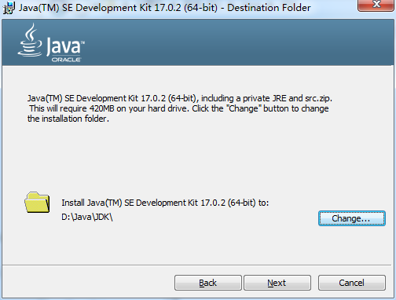

安装完毕直接关闭弹窗：

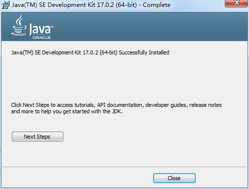

**Step03** 用记事本编写第一个Java小程序，代码如下：

```java
public class Test {

    public static void main(String[] args) {
        System.out.println("hello, world");
    }
}
```

保存文件名为`Test.java`，目录在`Java安装目录\bin`：
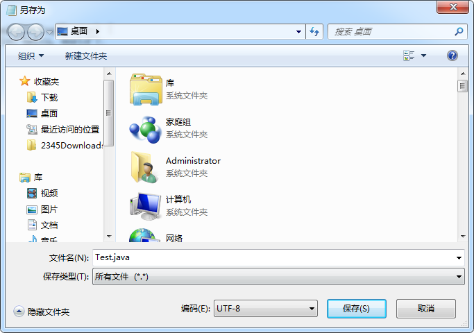

**Step04** 打开命令行窗口，切换到 `Java安装目录\bin` :
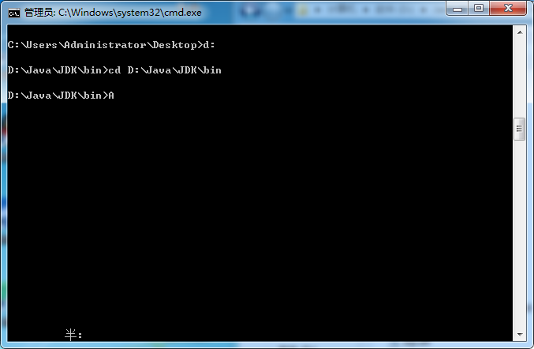

**Step05** 运行Java代码，先执行`javac Test.java`，编译完毕以后，在执行 `java Test`，然后可以在屏幕上看到输出 `hello, world` ：
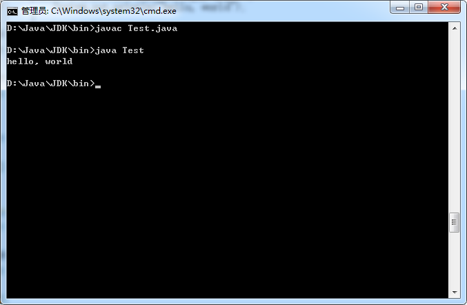

经过上面的步骤，可以运行Java代码。但是不太方便的是，每次到需要在命令行窗口里面切换到 *Java安装目录*，甚至于将Java文件保存到*Java安装目录*中，为了解决这个问题，我们需要配合Java环境变量，目的是在命令行窗口中直接使用`javac`、`java`等命令。

**Step06** 配置Java环境变量

依次点击 `此电脑` ->（右击鼠标）-> `属性` -> `高级系统设置` -> `环境变量` -> `系统变量` :
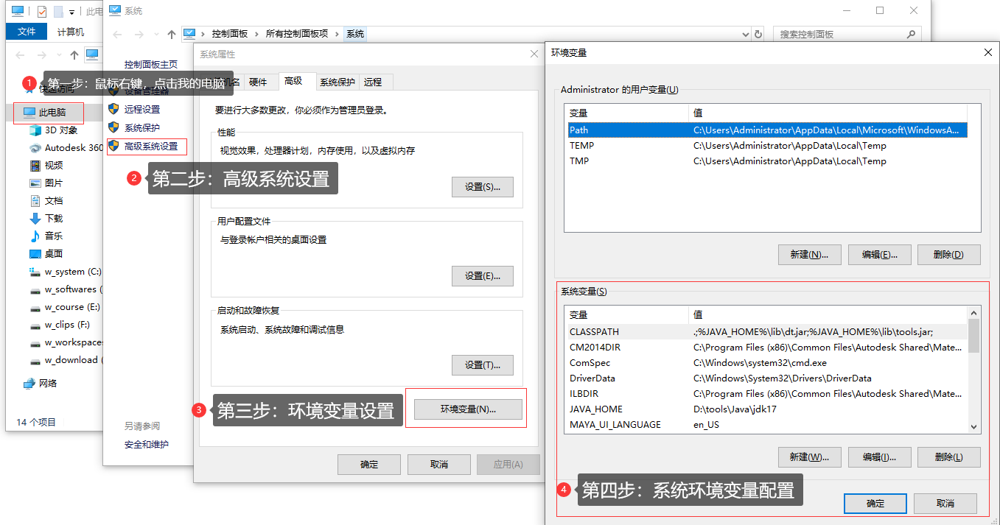

1. 点击`系统变量`下面`新建`，添加系统变量`JAVA_HOME`，变量值为JDK安装路径，比如`D:\Java\JDK`；

2. 编辑`Path`变量，添加一个值：`%JAVA_HOME%\bin`；

3. 编辑`CLASSPATH`变量，变量值为：`.;%JAVA_HOME%\lib\dt.jar;%JAVA_HOME%\lib\tools.jar;`

4. 验证Java环境变量是否配置成功，重新打开命令行窗口，输入`java`，输出如下信息则配置成功：
   
   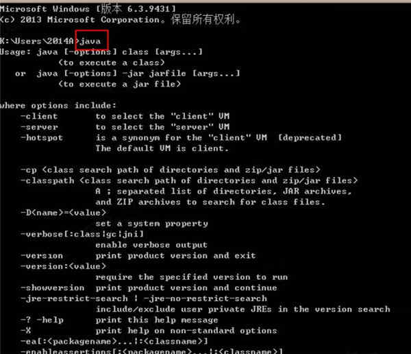

经过上面的步骤，我们已经成功的安装Java开发环境，可以编写代码和运行代码。但是，如果使用记事本等工具编写代码，极不方便，所以，为了更好的编程体验，我们需要安装专门用于写代码的软件，比如**IntelliJ IDEA**。

**Step07** 安装**IntelliJ IDEA**：

1. 从[官网](https://www.jetbrains.com/idea/download/#section=windows)下载IDEA社区版；
   
   

2. **IDEA**安装很简单，直接双击`exe`文件，然后默认安装即可；
   
   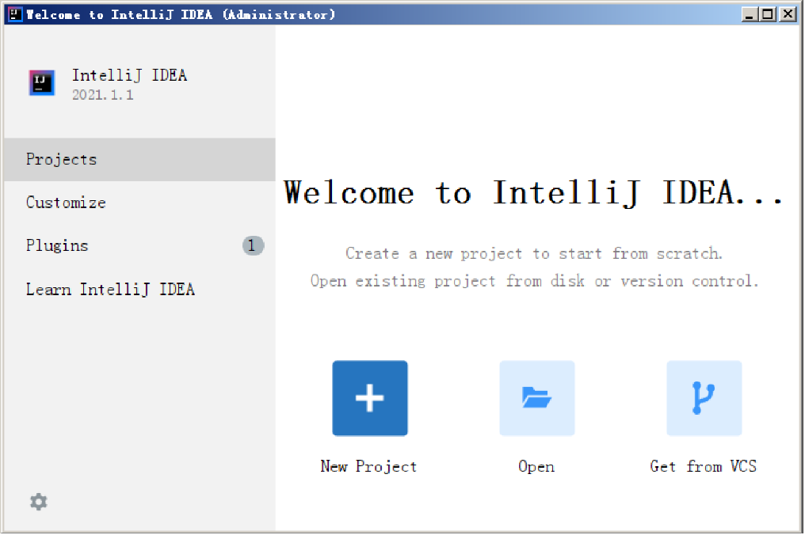

3. 点击`New Project`新建工程，在弹出的界面中选择`Java`选项：
   
   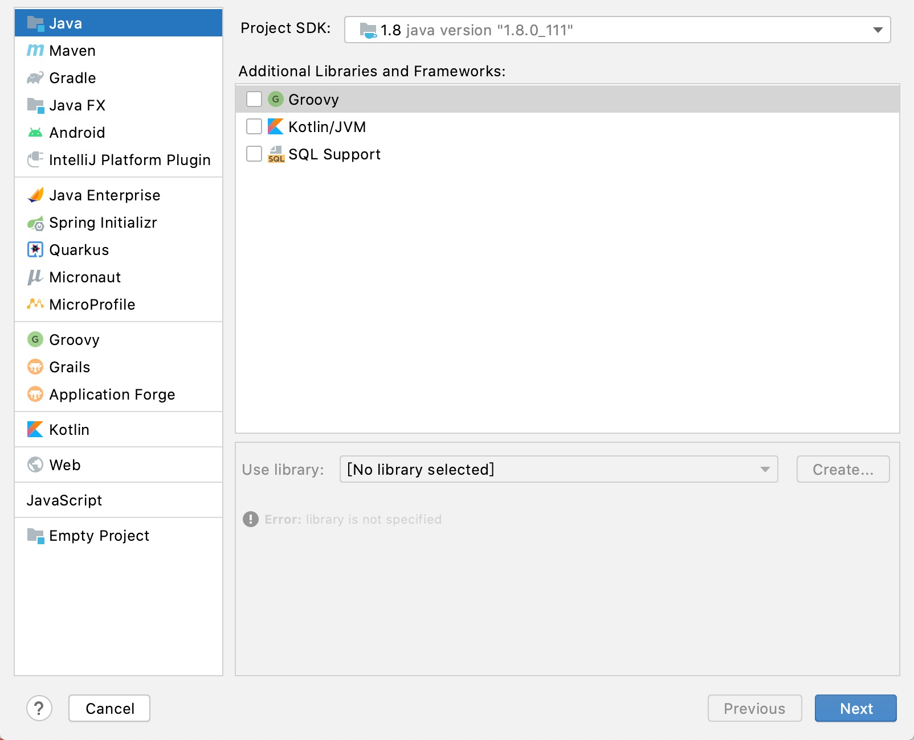
   
   点击`Next`，在输入工程名字的界面输入工程名字，比如`FirstProject`：
   
   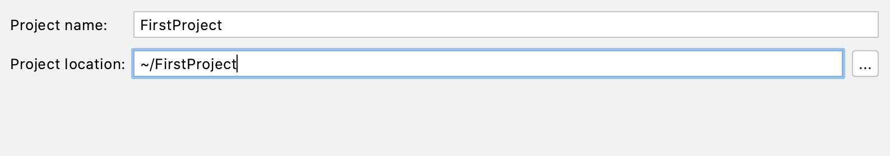

4. 展开工程名`FirstProject`，在`src`目录上右击，选择`Java Class`新建Java类：
   
   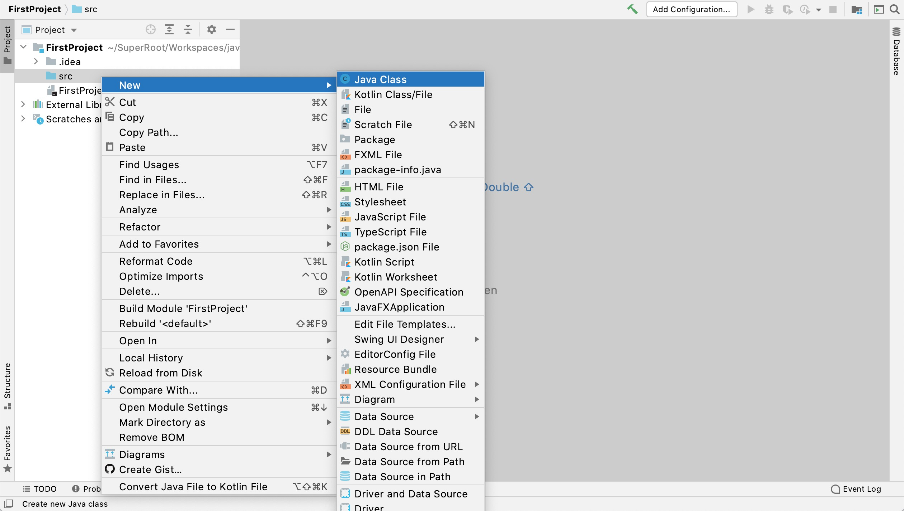

5. 输入文件名字，比如`Test`，然后在打开的编辑区中输入以下代码：
   
   ```java
   public class Test {
       public static void main(String[] args) {
           System.out.println("hello, world");
       }
   }
   ```
   
   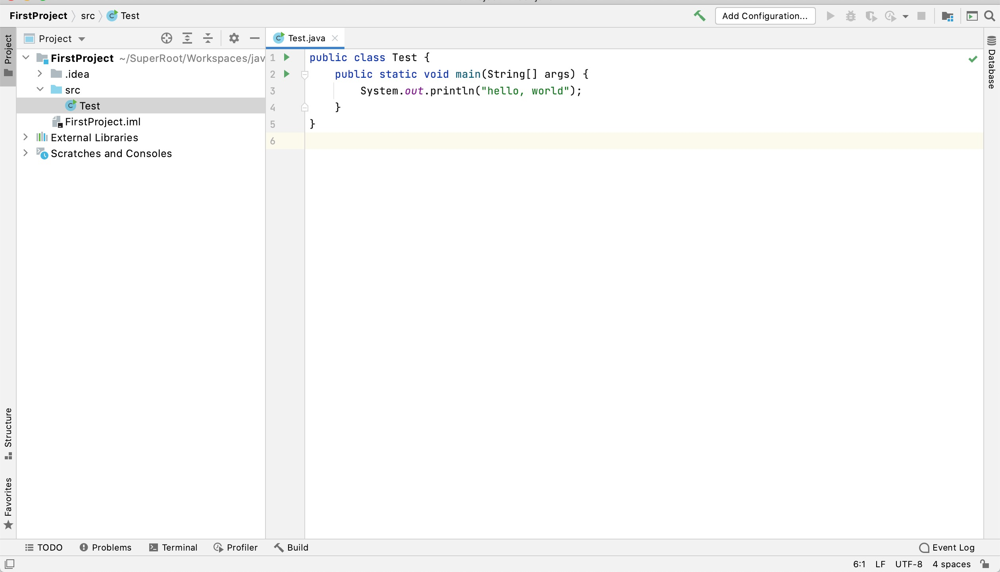

6. 右击编辑区，在弹窗中选择`Run 'Test.main()'`，运行Java代码：
   
   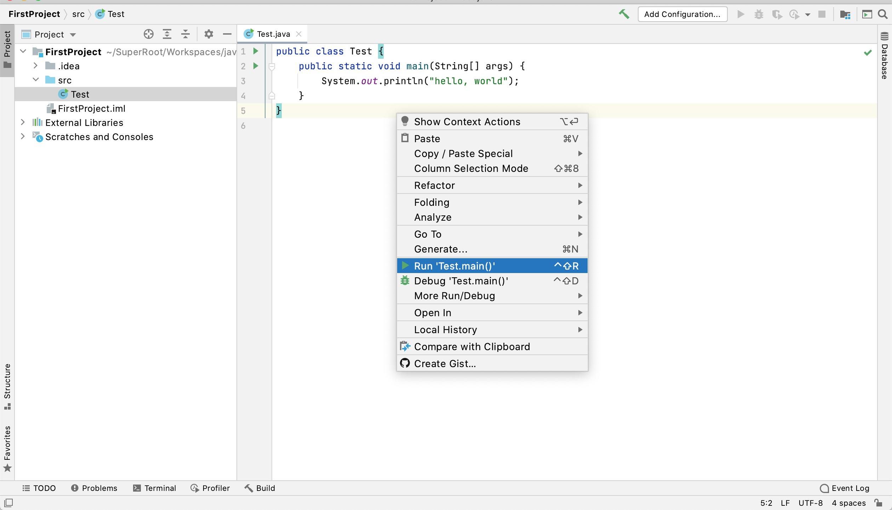
   
   运行完毕以后，可在编辑区下方看到运行结果，如下所示：
   
   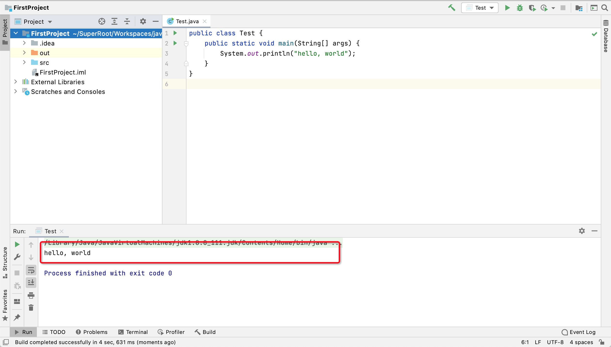

至此，Java开发环境全部搭建完毕。
