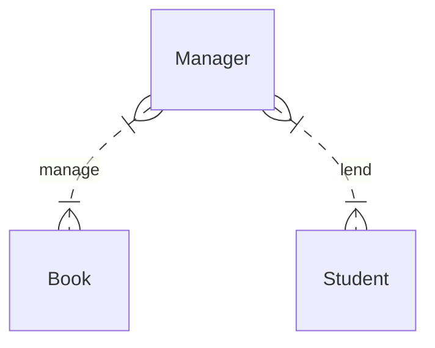

# 面向对象

**面向对象**（`Object-Oriented Programming`）是 Java 非常核心的概念，面向对象是一种编程思想，Java将任何编程对象抽象成对象（`Everything Is Object`）。


> **面向对象**本身是一个很抽象的概念，在介绍面向对象时，还会涉及另外一个概念——**面向过程**，在此我们先跳过这些生涩的概念，先从代码本身来理解面向对象的思想及具体实现。


前面的学习当中，我们创建了一个类，有个非常明显的特点——文件名和类名是一致的：

```java
public class Test {
    public static void main(String[] args) throws IOException {
        // 代码
        // ...
    }
}
```


这样的设计是 Java 面向对象的体现，运行任何的代码都需要在类中执行，换句话来说，类是 Java 代码中的基本单位，**Java程序是由一个一个的类组成的**。


假设现在我们要完成一个图书管理系统，这个系统中包括的实体有图书管理员、书本、学生等，其ER图如下：



在本示例中，Java代码实现会将`管理员`、`学生`、`书`三个实体对应三个Java类：`Manager`、`Student`、`Book`。每个实体都有对应**属性**和**行为**，其对应为（可能存在的属性和方法）：

- *Manager*
  
  - 属性
    
    - 姓名 - name
    
    - 工号 - num
  
  - 行为
    
    - 管理书籍 - manage()

- *Student*
  
  - 属性
    
    - 姓名 - name
    
    - 学号 - sno
  
  - 行为
    
    - 借书 - lend()
    
    - 还书 - refund()

- *Book*
  
  - 属性
    
    - 书名 - bookName
    
    - 出版社 - publisher


这三个实体我们用代码来表示**大概**是这样：

```java
// 管理员
Manager 
{
    String name;
    String num;
    manage();
}
```

```java
// 学生
Student
{
    String name;
    String sno;
    lend();
    refund();
}
```

```java
// 书
Book
{
    String bookName;
    String publisher;
}
```


像这样将现实生活中的一个实体映射到一个Java类中，并将实体的属性和方法抽象到Java类中的思想，就是面向对象编程的思想。所以，在Java编程中，**一切皆对象**。


## 类和对象

在上一小节中，我们阐述了面向对象的编程思想以及如何将现实生活中的实体映射到 Java 类中，现在我们来学习怎么定义类。


在 Java 中，类用关键字`class`标识，其基本格式为：

```java
public class 类名 {
    // 属性
    // ...
    // 方法
}
```

> **注意：**
> 
> `public`关键字修饰的类，表示可以被外部类访问，也表示该类为主类，被`public`修饰的主类类名必须和文件名一致。


> **类名的命名规范：**
> 
> 类名的命名规范和变量基本一致，由大小写的英文字母组成，驼峰命名方式，首字母大写。


### 属性和方法

类中可以包括属性（成员变量）和方法（成员方法）。


#### 属性

类中的属性定义和变量定义基本一致，比如`Book`类中`bookName`、`publisher`，可以这么定义：

```java
public class Book {
    String bookName;
    String publisher;
}
```


#### 方法

方法即类的行为，属性用于提供类所需要的数据，方法直接对数据进行操作。方法的语法结构为：

```java
修饰符 返回值 方法名 (参数列表)
{
    // 方法体
}
```

> 关于修饰符，本节先跳过，后续章节会详细介绍。


##### 返回值


##### 参数列表


##### 方法重载


### 构造方法


## 访问控制


## 继承


## 多态


## 接口
