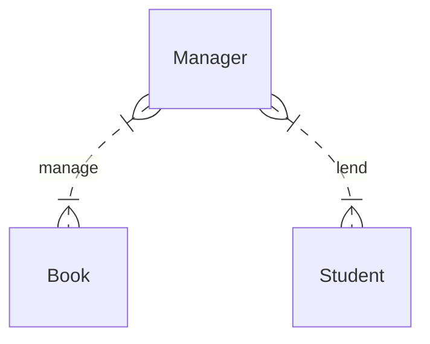

# 面向对象

**面向对象**（`Object-Oriented Programming`）是 Java 非常核心的概念，面向对象是一种编程思想，Java将任何编程对象抽象成对象（`Everything Is Object`）。

> **面向对象**本身是一个很抽象的概念，在介绍面向对象时，还会涉及另外一个概念——**面向过程**，在此我们先跳过这些生涩的概念，先从代码本身来理解面向对象的思想及具体实现。

前面的学习当中，我们创建了一个类，有个非常明显的特点——文件名和类名是一致的：

```java
public class Test {
    public static void main(String[] args) throws IOException {
        // 代码
        // ...
    }
}
```

这样的设计是 Java 面向对象的体现，运行任何的代码都需要在类中执行，换句话来说，类是 Java 代码中的基本单位，**Java程序是由一个一个的类组成的**。

假设现在我们要完成一个图书管理系统，这个系统中包括的实体有图书管理员、书本、学生等，其ER图如下：



在本示例中，Java代码实现会将`管理员`、`学生`、`书`三个实体对应三个Java类：`Manager`、`Student`、`Book`。每个实体都有对应**属性**和**行为**，其对应为（可能存在的属性和方法）：

- *Manager*
  
  - 属性
    
    - 姓名 - name
    
    - 工号 - num
  
  - 行为
    
    - 管理书籍 - manage()

- *Student*
  
  - 属性
    
    - 姓名 - name
    
    - 学号 - sno
  
  - 行为
    
    - 借书 - lend()
    
    - 还书 - refund()

- *Book*
  
  - 属性
    
    - 书名 - bookName
    
    - 出版社 - publisher

这三个实体我们用代码来表示**大概**是这样：

```java
// 管理员
Manager 
{
    String name;
    String num;
    manage();
}
```

```java
// 学生
Student
{
    String name;
    String sno;
    lend();
    refund();
}
```

```java
// 书
Book
{
    String bookName;
    String publisher;
}
```

像这样将现实生活中的一个实体映射到一个Java类中，并将实体的属性和方法抽象到Java类中的思想，就是面向对象编程的思想。所以，在Java编程中，**一切皆对象**。

## 类和对象

在上一小节中，我们阐述了面向对象的编程思想以及如何将现实生活中的实体映射到 Java 类中，现在我们来学习怎么定义类。

在 Java 中，类用关键字`class`标识，其基本格式为：

```java
public class 类名 {
    // 属性
    // ...
    // 方法
}
```

> **注意：**
> 
> `public`关键字修饰的类，表示可以被外部类访问，也表示该类为主类，被`public`修饰的主类类名必须和文件名一致。

> **类名的命名规范：**
> 
> 类名的命名规范和变量基本一致，由大小写的英文字母组成，驼峰命名方式，首字母大写。

### 属性和方法

类中可以包括属性（成员变量）和方法（成员方法）。

#### 属性

类中的属性定义和变量定义基本一致，比如`Book`类中`bookName`、`publisher`，可以这么定义：

```java
public class Book {
    String bookName;
    String publisher;
}
```

#### 方法

方法即类的行为，也可以称为函数，属性用于提供类所需要的数据，方法直接对数据进行操作。方法的语法结构为：

```java
修饰符 返回值 方法名 (参数列表)
{
    // 方法体
}
```

> 关于修饰符，本节先跳过，后续章节会详细介绍。 


**返回值**

返回值用于标识方法对数据操作后的结果。返回值可以是基本的数据类型，也可以是一个类，甚至可以没有返回值，如果没有返回值，用关键字`void`标识。

若方法有返回值，则在方法体中用 `return` 语句指明要返回的值，其格式如下所示：

```java
return 表达式
```

如果返回值为`void`，`return` 语句可以省略。


**参数列表**

参数列表用于给函数传递参数，参数列表可以为`0`、`1`或者多个。每个参数相当于声明一个变量。比如，在`Book`类中申明两个方法：

```java
public class Book {

    String bookName;
    String publisher;

    // 无参数的方法
    public String getBookName() {
        return bookName;
    }

    // 带有一个参数 bookName 的方法
    public void setBookName(String bookName) {
        this.bookName = bookName;
    }
}
```


### 创建实例

在上面的示例中，我们创建了一个`Book`类，该类只是将现实生活中的`书`进行抽象并映射到Java代码里面的`Book`，但是`Book`类本身没有具体指向是哪一本书，在图书管理系统中，不管是`借书`还是`还书`都是一本具体的书。`书`是一个类，`具体的一本书`是`书`的一个**实例**。

在实际的业务场景中，使用的是具体的实例，所以我们需要创建实例，实例即类的对象。创建对象需要使用到 `new` 这个关键字，示例：

```java
Book hamlet = new Book();
```

本示例中，`hamlet`是`Book`的一个具体实例，`new Book()`表示创建一个实例。有了实例，可通过`.`访问实例的属性或者方法：

```java
Book hamlet = new Book();
// 访问实例的属性
hamlet.bookName = "哈姆雷特";
// 访问实例的方法
System.out.println(hamlet.getBookName());
```


### 构造函数

再来看看上面的示例：

```java
Book hamlet = new Book();
hamlet.bookName = "哈姆雷特";
```

像这样每次“创建一本书”时，都对书名重新赋值，这样显然是不方便的。类似于生产一件商品，书名是商品的一个参数，需要在“创建"就需要指定，如果要实现这样的功能，则需要构造函数。


构造函数也称为构造方法，是类的一种特殊方法，默认情况下，Java会提供默认的构造函数，比如`Book`类，默认的构造方法为：

```java
public Book(){

}
```

构造函数有几个明显的特点：

1. **方法名必须与类名相同**；

2. **没有返回值（实际上返回的是类示例），无须定义返回值类型**；

3. **可以有 0 个、1 个或多个参数**；

4. **实例化对象时，构造函数首先被调用，构造函数经常用于初始化类**；


> 构造方法不能被 `static`、`final`、`synchronized`、`abstract` 和 `native`（类似于 `abstract`）修饰。


如果修改了默认构造方法（修改参数或者方法体），默认的构造方法就会被覆盖。


所以，在创建`Book`类时，指定`bookName`参数，构造方法为：

```java
public Book(String bookName){
    // 函数体
    // 比如：
    this.bookName = bookName;
}
```

带有参数的构造函数的函数体通常会通常会有一句：

```java
this.bookName = bookName;
```

`this`关键字表示当前类，`this`关键字可以调用类的属性或方法。`this.bookName`表示类的属性，`bookName`表示构造方法的参数。


当定义了构造函数，在实例化对象时，必须与构造函数的参数保持一致，比如实例化`Book`类为：

```java
Book hamlet = new Book("哈姆雷特");
```


### 方法重载

在实例化`Book`类时，也有可能在指定书名（`bookName`）的同时指定出版社（`publisher`），但这两者并不是互斥的，也就是说，应该还有一个构造函数同时指定`bookName`和`publisher`，形如：

```java
public Book(String bookName, String publisher){
    this.bookName = bookName;
    this.publisher = publisher;
}
```

Java允许这两个构造函数同时存在，像这样**方法名相同，参数不同的方法，称为方法重载**。


构造方法是特殊的方法，所以类里面的普通的方法也允许方法重载。


参数不同有三层含义：

1. **参数个数不同**；

2. **参数类型不同**；

3. **参数顺序不同**；


## 访问控制

Java为了成员属性的访问安全，可以使用`包`来隔离类，在不同的类中，也有不同的访问控制。

### 包

在windows系统的资源管理器中，在某个文件夹下，不能允许有重复的文件，在团队协作的代码开发中，同样不能避免团队成员命名一个类是没有命名冲突。另外一方面，在一个大型的系统中，包括了成千上万的Java类，为了合理方便的管理类，也需要将不同的类放到不同的文件夹当中，在Java系统中，**包**（`package`）就充当这样的文件夹的角色。


**包的命名：**

包的命名遵循以下规范：

1. 由小写字母组成；

2. 一般来说，由企业或者组织的域名颠倒；

3. 每个子包用`.`隔开；

比如，你所在的企业或者组织的域名为：`example.com`，Java包为：`com.example`，根据业务功能或者业务板块，继续分为`com.example.package1`、`com.example.package2`等。


**package：**

将不同的Java类放到不同的包下以后，必须要`package`标识当前类在哪一个包，比如`Book`类在`com.example.package1`包下，则`Book`类的第一行应该为：

```java
package com.example.package1;
```

`package`关键字用于标识某个类在某个包下。


**import：**

一个完整的类名包括包名和类名，如果两个类在同一包下，则可以直接引用，如果不在同一包下，一种方式就使用完整的类名，比如实例化`Book`类（包名为：`com.example.package1`）：

```java
com.example.package1.Book book = new com.example.package1.Book();
```

这样显然不方便，更好的方式是使用`import`导入该类：

```java
import com.example.package1.Book;

Book book = new Book();
```

`import`语句一般放在文件开头，所以Java文件的大概结构为：

```java
package 语句;


import 语句;

// 类
public class ...
```

如果需要导入同一个包中的不同类，可以使用`import`语句分别导入，也可以使用通配符`*`，表示导入该包下的所有类，示例：

```java
// 导入 com.example.package1 包下的所有类
import com.example.package1.*;
```


### 作用域

作用域是变量或者方法能够生效的范围，Java提供`public`、`protected`、`private`等修饰符可以用来限定访问作用域。


在Java中，针对类、成员方法和属性，Java提供了4种访问控制权限，分别是`private`、`default`、`protected`和`public`，访问控制权限按级别由小到大依次增大。


- **private**
  
  `private`属于私有访问权限，用于修饰类的属性和方法，也可以修饰内部类。类的成员一旦使用了`private`关键字修饰，则该成员只能在本类中进行访问。

- **default**
  
  `default`属于默认访问权限，如果一个类中的属性或方法没有任何的访问权限声明，则该属性或方法就是默认的访问权限，默认的访问权限可以被本包中的其他类访问，但是不能被其他包的类访问。

- **protected**
  
  `protected`属于受保护的访问权限。如果一个类中的成员使用了`protected`访问权限，则只能被本包及不同包的子类访问。

- **public**
  
  `public`属于公共访问权限。如果一个类中的成员使用了`public`访问权限，则该成员可以在所有类中被访问，不管是否在同一包中。


访问控制修饰符的权限如下表所示：

| 访问范围   | private | default | protected | public |
|:------:|:-------:|:-------:|:---------:|:------:|
| 同一类中   | √       | √       | √         | √      |
| 同一包中的类 |         | √       | √         | √      |
| 不同包的子类 |         |         | √         | √      |
| 全局范围   |         |         |           | √      |


### 静态属性和静态方法

先看一个示例，定义一个学生(`Student`)类，该类包含两个成员属性：姓名(`name`)和学号(`no`)，`Student`类的定义为：

```java
public class Student{
    String name;
    String no;
}
```

因为每个学生的姓名和学号都有所不同，对应的，每个`Student`实例的属性值都不尽相同。现在我们在定义一个属性`String tutor`，表示该班的辅导员，对应学生类来说，所有的辅导员都是一个，也就是说，对于`Student`类来说，`tutor`这个属性是共享的。为达到这样的目的，我们需要使用`static`关键字。


使用`static`修饰的属性称为**静态属性**，所有的示例共享，**直接通过类名访问**。

```java
public class Student{
    String name;
    String no;
    // 新增一个静态属性
    static String tutor;
}
```

可以直接通过类名访问静态属性：

```java
System.out.println(Student.tutor);
```


## 继承


## 多态


## 接口
