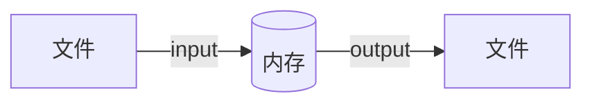

# I/O

粗略的说，计算机上运行的软件都是对文件进行操作，安装软件，即是将文件拷贝到计算机中，运行软件即是对特定的文件进行操作。`流`（`Stream`）是一种形象的描述，就像流水一样，表示数据的流向。`I/O`流是相对计算机内存来说，将外部文件的数据加载到内存中，即是输入（`InputStream`），将内存中的数据写入到外部文件，即是输出（`OutputStream`）。`InputStream`对应读（`read`）文件，`OutputStream`对应写（`write`）文件。

## File

`File`，文件，是`I/O`流操作的对象，Java 提供了`File`对象来操作文件和目录。

## 字节流

## 字符流
