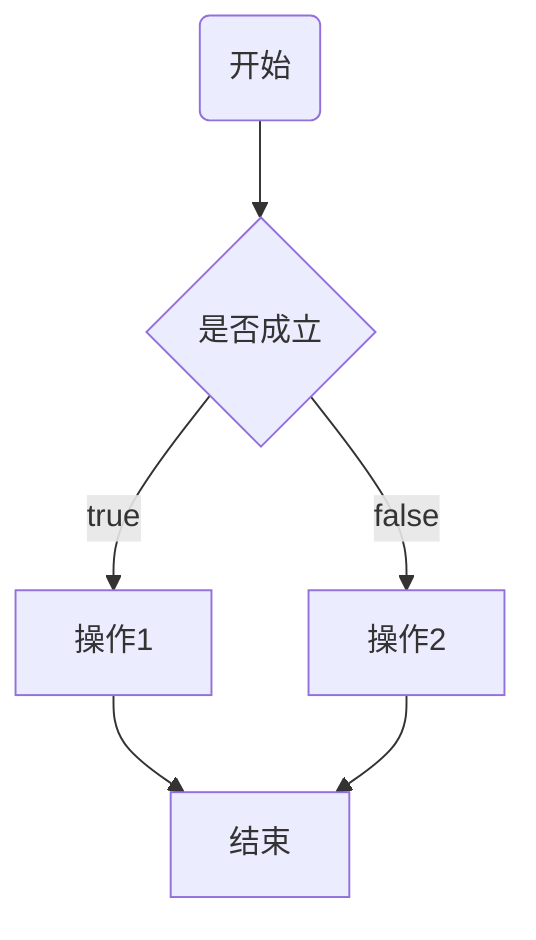

# 流程控制

一般来说，Java代码都是从上到下逐行执行的（顺序流程）。但是某些场景中，这种结构并不适用，比如：教务系统中，根据用户名的角色，跳转到相应的教师页面或者学生页面（有条件的执行），又比如：判断`2`到`100`之间哪些数是素数（一个一个的挨着判断，重复的执行），这些场景就需要执行流程控制。流程结构可分为**分支结构**和**循环结构**。

## 分支结构

分支结构根据不同的条件执行不同的操作，就像路标一样，知识不同通向路径。Java中分支结构有`if`语句和`switch`语句。分支结构的大致流程示意图如下图所示：





### if 语句

`if` 语句会判断给出条件是否成立，如果成立则执行 `if` 语句中的代码块。对应到中文语境中就是`如果...就...`。`if`语句的语法结构为：

```java
if(布尔表达式) {
   // 如果布尔表达式为true将执行的语句
}
```

布尔表达式为计算结果为布尔值表达式，可以为条件运算或者逻辑运算。示例：

```java
// 考试分数大于等于90分，就买奥利奥
Scanner scanner = new Scanner(System.in);
int score = scanner.nextInt();
if (score >= 90) {
    System.out.println("给你买奥利奥");
}
```


#### if-else 子句

`else`子句用于当`if`语句的条件不成立的时候执行，对应到中文的语境就是`如果...否则...`。`else`子句的语法结构为：

```java
if(布尔表达式) {
   //如果布尔表达式的值为true
} else {
   //如果布尔表达式的值为false
}
```

示例：

```java
// 输入分数，判断是否及格
System.out.println("请输入分数：");
Scanner scanner = new Scanner(System.in);
int score = scanner.nextInt();
if (score >= 60) {
    System.out.println("及格");
}
else {
    System.out.println("不及格");
}
```

#### 多分支的 if-else-if 语句

`if...else if...`语句用于当有多个条件选项的时候，其语法格式为：

```java
if (布尔表达式1) {
   //如果布尔表达式1的值为true执行代码
} else if (布尔表达式2) {
   //如果布尔表达式2的值为true执行代码
} else if (布尔表达式3) {
   //如果布尔表达式3的值为true执行代码
} else {
   //如果以上布尔表达式都不为true执行代码
}
```

`else if`语句对应一个布尔表达式，`else`语句是当前面的条件都不满足的时候执行，是可选的。 

示例，输入百分制成绩，输出优`[90, 100]`、良`[80, 90)`、中`[60, 80)`、差`[0, 60)` ：

```java
System.out.println("请输入分数：");
Scanner scanner = new Scanner(System.in);
int score = scanner.nextInt();
if (score >= 90) {
    System.out.println("优");
}
else if (score >= 80){
    System.out.println("良");
}
else if (score >= 60){
    System.out.println("中");
}else {
    System.out.println("差");
}
```

#### if-else语句的嵌套

`if...else...`语句嵌套即是在`if...else...`子句中嵌套`if...else...`，其语法格式为：

```java
if (布尔表达式1) {
   //如果布尔表达式1的值为true执行代码
   if (布尔表达式2) {
      //如果布尔表达式2的值为true执行代码
   }
}
```

如上面的示例中，改造成嵌套结构为：

```java
System.out.println("请输入分数：");
Scanner scanner = new Scanner(System.in);
int score = scanner.nextInt();
if (score >= 60) {
    if (score >= 90){
        System.out.println("优");
    }else if (score >= 80){
        System.out.println("良");
    }else {
        System.out.println("中");
    }
}else {
    System.out.println("差");
}
```

`if...else...`语句可以合理的嵌套使用。

### switch 语句

`switch`语句是多分支结构的另外一种实现，是`if...else...`分支比较多的简化形式。 `switch`语句需要注意：

1. `switch` 语句中的变量类型只能为 `byte`、`short`、`int`、`char` 或者 `String`；

2. `swtich`语句有多个`case`语句，每个`case`语句对应一个分支；

3. 每个`case`语句可以有一句`break`语句，当遇到`break`语句时，程序跳出`switch`语句；

4. `switch` 语句可以包含一个 `default` 分支，该分支必须是 `switch` 语句的最后一个分支；

`swtich`语句的语法格式为：

```java
switch (变量){
    case 值1:
        //
        break;
    case 值2:
        //
        break;
    case 值3:
        //
        break;
    case 值4:
        //
        break;
    default:
        //
}
```

示例，输入百分制成绩，输出优`[90, 100]`、良`[80, 90)`、中`[60, 80)`、差`[0, 60)` （使用`switch`语句实现）：

```java
Scanner scanner = new Scanner(System.in);
int score = scanner.nextInt();
score /= 10;
switch (score){
    case 10:
    case 9:
        System.out.println("优");
        break;
    case 8:
        System.out.println("良");
        break;
    case 7:
    case 6:
        System.out.println("中");
        break;
    default:
        System.out.println("差");
}
```

## 循环结构

循环结构用于重复的执行一段代码，在Java中，循环结构有`for`循环和`while`循环。

### for循环

`for`循环一般用于循环特定次数的场景，其流程示意图为：

```flowchart
st=>start: 表达式1
cond=>condition: 表达式2
op1=>operation: 执行语句
op2=>operation: 操作2
op3=>operation: 表达式3
ed=>end: 结束

st->cond
cond(false)->ed
cond(true)->op1->op3->cond
```

`for`循环的语法格式为：

```java
for(表达式1;表达式2;表达式3) {
    语句块;
}
```

结合`for`循环的语法格式和流程示意图，我们来看看其执行顺序：

1. 先执行`表达式1`；

2. 计算`表达式2`，如果值为`false`，终止循环，否则进入循环体；

3. 执行`for`循环语句块；

4. 一次循环结束，进入步骤`2`，执行下一次循环；

开看个简单示例：

```java
for (int i=0; i<10; i++){
    System.out.printf("这是第%d次循环\n", i+1);
}
```

> **注意：**
> 
> 1. `for`循环中，三个表达式需要用分号（`;`）隔开；
> 
> 2. `表达式1`、`表达式2`、`表达式3`在特定条件下可以省略；


省略`表达式1`：

```java
// 先定义变量 i
int i = 0;
for (; i<10; i++){
    System.out.printf("这是第%d次循环\n", i+1);
}
```

省略`表达式2`：

```java
for (int i = 0; ; i++){
    System.out.printf("这是第%d次循环\n", i+1);
    if (i > 10){
        // 在特定条件下终止循环，break的使用后面详细概述
        break;
    }
}
```

省略`表达式3`：

```java
for (int i = 0; i<10; ){
    System.out.printf("这是第%d次循环\n", i+1);
    // 改变变量 i 的值
    i++;
}
```


### while循环

`while`循环是循环结构的另外一种实现，`while`循环一般用于循环次数不确定的情况，满足特定条件为止，语法格式为：

```java
while (表达式){
    // 语句块
}
```

`while`语句的循环逻辑很简单，`表达式`的值为`true`就执行，否则就终止。示例：

```java
int i = 1;
while (i <= 10){
    System.out.printf("这是第%d次循环\n", i);
    i++;
}
```

> **注意：**
> 
> `while`语句一定要注意循环条件的变化，避免陷入死循环。


### do while 循环

`do...while`循环和`while`循环非常相似。对于 `while` 语句而言，如果不满足条件，则不能进入循环。`do...while`循环先执行，再判断循环条件，至少会执行一次，如果循环条件的值为 `true`，则语句块一直执行，直到循环条件的值为 `false`。示例：

```java
int i = 1;
do {
    System.out.printf("这是第%d次循环\n", i);
    i++;
} while (i <= 10);
```


### break 和 continue 语句

在某些场景中，需要"打乱"循环结构的执行流程。Java提供了`break`、`continue`来改变循环结构的执行流程。

#### break

在前面的示例中提到过`break`语句，`break`语句用于终止当前循环或者跳出`switch`结构。

示例，求两个数的最大公约数：

```java
int i = 14;
int j = 21;
int flag = i>j ? j : i;
for (int k = flag; k >= 1; k--){
    if (i%k == 0 && j%k==0){
        System.out.println("最大公约数为：" + k);
        break;
    }
}
```

#### continue

`continue` 的作用是让程序立刻跳转到下一次循环。在 `for` 循环中，`continue` 语句使程序立即跳转到更新语句。在 `while` 或者 `do while` 循环中，程序立即跳转到布尔表达式的判断语句。示例，输出某个数的所有因子：

```java
int num = 24;
for (int i=1; i<num; i++){
    if (num % i != 0){
        continue;
    }
    System.out.println(i);
}
```


### 循环结构嵌套

循环结构的嵌套即在一个循环结构中嵌套另外一个循环结构，`for`循环和`while`循环可以相互嵌套。示例，输出乘法口诀表：

```java
for (int i = 1; i < 10; i++){
    for (int j = 1; j <= i; j++){
        System.out.printf("%d * %d = %d  ", j, i, i*j);
    }
    System.out.println();
}
```
