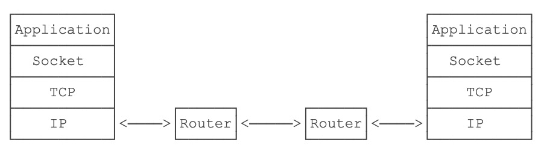

# JAVA网络编程


## 网络编程概述

> 网络编程是Java最擅长的方向之一，使用Java进行网络编程时，由虚拟机实现了底层复杂的网络协议，Java程序只需要调用Java标准库提供的接口，就可以简单高效地编写网络程序。


计算机网络是通过传输介质、通信设施和网络通信协议，把分散在不同地点的计算机设备互连起来的，实现资源共享和数据传输的系统。网络编程就是编写程序使互联网的两个（或多个）设备（如计算机）之间进行数据传输。Java语言对网络编程提供了良好的支持。通过其提供的接口我们可以很方便地进行网络编程。


## Java Socket网络编程

Java的网络编程主要涉及到的内容是 **Socket** 编程。Socket，套接字，就是两台主机之间逻辑连接的端点。TCP/IP协议是传输层协议，主要解决数据如何在网络中传输，而HTTP是应用层协议，主要解决如何包装数据。Socket是通信的基石，是支持TCP/IP协议的网络通信的基本操作单元。

Socket，实际上是对TCP/IP协议的封装，Socket本身并不是协议，而是一个调用接口（API），通过Socket，我们才能使用TCP/IP协议。实际上，Socket跟TCP/IP协议没有必然的关系，Socket编程接口在设计的时候，就希望也能适应其他的网络协议。

Socket是一个抽象概念，一个应用程序通过一个Socket来建立一个远程连接，而Socket内部通过TCP/IP协议把数据传输到网络：



为什么需要Socket进行网络通信？因为仅仅通过IP地址进行通信是不够的，同一台计算机同一时间会运行多个网络应用程序，例如浏览器、QQ、邮件客户端等。当操作系统接收到一个数据包的时候，如果只有IP地址，它没法判断应该发给哪个应用程序，所以，操作系统抽象出Socket接口，每个应用程序需要各自对应到不同的Socket，数据包才能根据Socket正确地发到对应的应用程序。

一个Socket就是由IP地址和端口号（范围是0～65535）组成，可以把Socket简单理解为IP地址加端口号。端口号总是由操作系统分配，它是一个0～65535之间的数字，其中，小于1024的端口属于*特权端口*，需要管理员权限，大于1024的端口可以由任意用户的应用程序打开。

使用Socket进行网络编程时，本质上就是两个进程之间的网络通信。其中一个进程必须充当服务器端，它会主动监听某个指定的端口，另一个进程必须充当客户端，它必须主动连接服务器的IP地址和指定端口，如果连接成功，服务器端和客户端就成功地建立了一个**TCP连接**，双方后续就可以随时发送和接收数据。当Socket连接成功地在服务器端和客户端之间建立后：

- 对服务器端来说，它的Socket是指定的IP地址和指定的端口号；
- 对客户端来说，它的Socket是它所在计算机的IP地址和一个由操作系统分配的随机端口号。

Socket网络编程的代码示例如下：

```java
import java.io.*;
import java.net.ServerSocket;
import java.net.Socket;
import java.nio.charset.StandardCharsets;

public class Server {
    public static void main(String[] args) throws IOException {
        ServerSocket ss = new ServerSocket(8080); // 监听指定端口
        System.out.println("server is running...");
        for (;;) {
            Socket sock = ss.accept();
            System.out.println("connected from " + sock.getRemoteSocketAddress());
            Thread t = new Handler(sock);
            t.start();
        }
    }
}

class Handler extends Thread {
    Socket sock;

    public Handler(Socket sock) {
        this.sock = sock;
    }

    public void run() {
        try (InputStream input = this.sock.getInputStream()) {
            try (OutputStream output = this.sock.getOutputStream()) {
                handle(input, output);
            }
        } catch (Exception e) {
            try {
                this.sock.close();
            } catch (IOException ioe) {
                System.out.println(ioe.toString());
            }
            System.out.println("client disconnected.");
        }
    }

    private void handle(InputStream input, OutputStream output) throws IOException {
        System.out.println("Process new http request...");
        BufferedReader reader = new BufferedReader(new InputStreamReader(input, StandardCharsets.UTF_8));
        BufferedWriter writer = new BufferedWriter(new OutputStreamWriter(output, StandardCharsets.UTF_8));
        // 读取HTTP请求:
        boolean requestOk = true;
//        String first = reader.readLine();
//        if (first.startsWith("GET / HTTP/1.")) {
//            requestOk = true;
//        }
        for (;;) {
            String header = reader.readLine();
            if (header.isEmpty()) { // 读取到空行时, HTTP Header读取完毕
                break;
            }
            System.out.println(header);
        }
        System.out.println(requestOk ? "Response OK" : "Response Error");
        if (!requestOk) {
            // 发送错误响应:
            writer.write("HTTP/1.0 404 Not Found\r\n");
            writer.write("Content-Length: 0\r\n");
            writer.write("\r\n");
            writer.flush();
        } else {
            // 发送成功响应:
            String data = "<html><body><h1>Hello, world!</h1></body></html>";
            int length = data.getBytes(StandardCharsets.UTF_8).length;
            writer.write("HTTP/1.0 200 OK\r\n");
            writer.write("Connection: close\r\n");
            writer.write("Content-Type: text/html\r\n");
            writer.write("Content-Length: " + length + "\r\n");
            writer.write("\r\n"); // 空行标识Header和Body的分隔
            writer.write(data);
            writer.flush();
        }
    }
}
```
