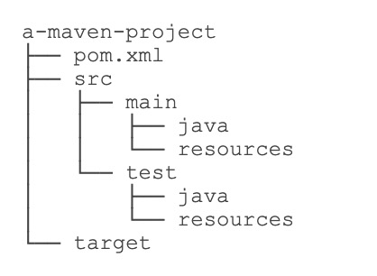
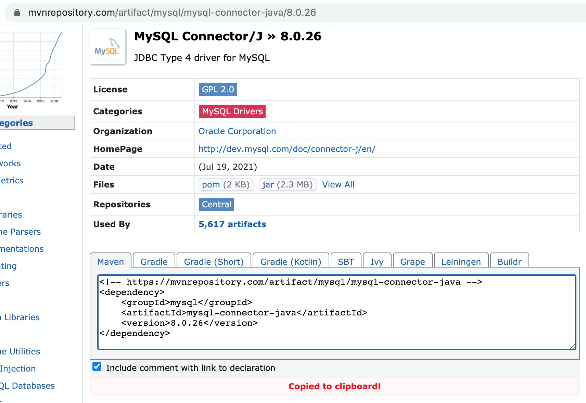
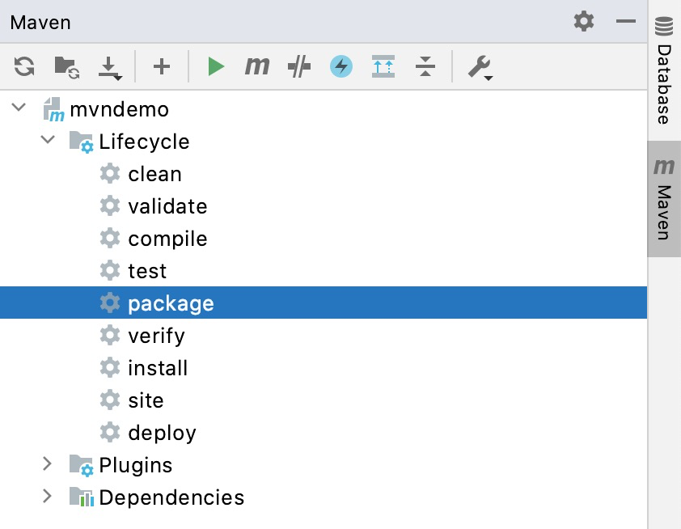

# Maven基础

> Maven是一个Java项目管理和构建工具，它可以定义项目结构、项目依赖，并使用统一的方式进行自动化构建，是Java项目不可缺少的工具。

Maven就是是专门为Java项目打造的管理和构建工具，它的主要功能有：

- 提供了一套标准化的项目结构；
- 提供了一套标准化的构建流程（编译，测试，打包，发布……）；
- 提供了一套依赖管理机制。

## Maven项目结构

一个使用Maven管理的普通的Java项目，它的目录结构默认如下：



**目录说明**

- ```pom.xml```  ---------------------- maven项目描述文件
- ```src/main/java```  ------------ 存放Java源码的目录
- ```src/main/resources``` ----- 存放资源文件的目录
- ```src/test/java``` ------------- 存放测试源码的目录
- ```src/test/resources``` ----- 存放测试资源的目录
- ```target``` ------------------------- 编译、打包生成的文件

```pom.xml``` 文件内容结构示例如下：

```xml
<project ...>
    <modelVersion>4.0.0</modelVersion>
    <groupId>com.itranswarp.learnjava</groupId>
    <artifactId>hello</artifactId>
    <version>1.0</version>
    <packaging>jar</packaging>
    <properties>
        ...
    </properties>
    <dependencies>
        <dependency>
            <groupId>commons-logging</groupId>
            <artifactId>commons-logging</artifactId>
            <version>1.2</version>
        </dependency>
    </dependencies>
</project>
```

**说明：**

`groupId`   ----------  类似于Java的包名，通常是公司或组织名称；

`artifactId`  ------  类似于Java的类名，通常是项目名称；

`version`   ----------  版本

```<dependency>``` ---- 声明依赖

## 依赖管理

Maven解决了依赖管理问题，会自动下载依赖包并把它放到classpath中。

### 依赖关系

Maven定义了几种依赖关系，分别是`compile`、`test`、`runtime`和`provided`：

| **scope** | **说明**                   | **示例**          |
|:---------:|:------------------------ | --------------- |
| compile   | 编译时需要用到该jar包（默认）         | commons-logging |
| test      | 编译Test时需要用到该jar包         | junit           |
| runtime   | 编译时不需要，但运行时需要用到          | mysql           |
| provided  | 编译时需要用到，但运行时由JDK或某个服务器提供 | servlet-api     |

### Maven镜像

Maven维护了一个[中央仓库](repo1.maven.org)（[repo1.maven.org](https://repo1.maven.org/)），所有第三方库将自身的jar以及相关信息上传至中央仓库，Maven就可以从中央仓库把所需依赖下载到本地。

Maven并不会每次都从中央仓库下载jar包。一个jar包一旦被下载过，就会被Maven自动缓存在本地目录（用户主目录的`.m2`目录），所以，除了第一次编译时因为下载需要时间会比较慢，后续过程因为有本地缓存，并不会重复下载相同的jar包。

### 搜索第三方组件

如果我们要引用一个第三方组件，比如`okhttp`，如何确切地获得它的`groupId`、`artifactId`和`version`？方法是通过[https://mvnrepository.com/](https://mvnrepository.com/)搜索关键字，找到对应的组件后，直接复制：



### 命令行编译

在命令中，进入到`pom.xml`所在目录，输入以下命令：

```shell
$ mvn clean package
```

如果一切顺利，即可在`target`目录下获得编译后自动打包的jar。

### 在IDE中使用Maven

几乎所有的IDE都内置了对Maven的支持。在 **IntelliJ IDEA** 中，只需通过 **package** 便可进行编译打包：

 

## 使用插件

maven可以使用插件，插件的使用格式如下：

```xml
<project>
    ...
    <build>
        <plugins>
            <plugin>
                <groupId>org.apache.maven.plugins</groupId>
                <artifactId>maven-shade-plugin</artifactId>
                <version>3.2.1</version>
                <executions>
                    <execution>
                        <phase>package</phase>
                        <goals>
                            <goal>shade</goal>
                        </goals>
                        <configuration>
                            ...
                        </configuration>
                    </execution>
                </executions>
            </plugin>
        </plugins>
    </build>
</project>
```
