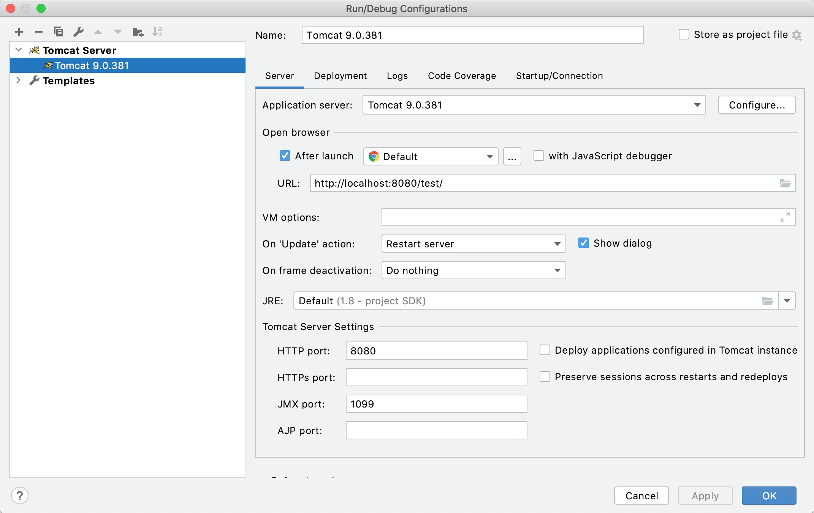

# Tomcat


## Tomcat 是什么

Tomcat 是由 Apache 开发的一个 ***Servlet*** 容器，实现了对 Servlet 和 JSP 的支持，并提供了作为Web服务器的一些特有功能，如Tomcat管理和控制平台、安全域管理和Tomcat阀等。


Tomcat简单的说就是一个运行JAVA的网络服务器，底层是Socket的一个程序，它也是JSP和Serlvet的一个容器。


## 安装

进入 [Tomcat 官方下载地址](https://tomcat.apache.org/download-80.cgi) 选择合适版本下载，并解压到本地即可。


## 启动

### window

进入安装目录下的 bin 目录，运行 ```startup.bat``` 文件，启动 Tomcat。

### Linux / Unix

进入安装目录下的 bin 目录，运行 ```startup.sh``` 文件，启动 Tomcat。

```shell
# 启动 Tomcat
./startup.sh
```


启动后，访问 [http://localhost:8080](http://localhost:8080/) ，可以看到 Tomcat 安装成功的测试页面，如下图：


## 配置

运行Tomcat需要JDK的支持【Tomcat会通过JAVA_HOME找到所需要的JDK】。


### 修改端口

改变tomcat的端口, 到tomcat主目录下的```conf/server.xml```文件中修改```port```的值：


## 部署

将打包好的 war 包放在 Tomcat 安装目录下的 `webapps` 目录下，然后在 bin 目录下执行 `startup.bat` 或 `startup.sh` ，Tomcat 会自动解压 `webapps` 目录下的 war 包。

成功后，可以访问 http://localhost:8080/xxx （xxx 是 war 包文件名）。


### IntelliJ 插件


**步骤**

1. 点击 Run/Debug Configurations > New Tomcat Server > local ，打开 Tomcat 配置页面。

2. 点击 Confiure... 按钮，设置 Tomcat 安装路径。

3. 点击 Deployment 标签页，设置要启动的应用。

4. 设置启动应用的端口、JVM 参数、启动浏览器等。

5. 成功后，可以访问 http://localhost:8080/（当然，你也可以在 url 中设置上下文名称）。





## Tomcat 重要目录

- **/bin** - Tomcat 脚本存放目录（如启动、关闭脚本）。 `*.sh` 文件用于 Unix 系统； `*.bat` 文件用于 Windows 系统。
- **/conf** - Tomcat 配置文件目录。
- **/logs** - Tomcat 默认日志目录。
- **/webapps** - webapp 运行的目录。


## web 工程发布目录结构

一般 web 项目路径结构：

```
|-- webapp                         # 站点根目录
    |-- META-INF                   # META-INF 目录
    |   -- MANIFEST.MF             # 配置清单文件
    |-- WEB-INF                    # WEB-INF 目录
    |   |-- classes                # class文件目录
    |   |   |-- *.class            # 程序需要的 class 文件
    |   |   |-- *.xml              # 程序需要的 xml 文件
    |   |-- lib                    # 库文件夹
    |   |   |-- *.jar              # 程序需要的 jar 包
    |   |-- web.xml                # Web应用程序的部署描述文件
    |-- <userdir>                  # 自定义的目录
    |-- <userfiles>                # 自定义的资源文件
```


**说明**

`webapp`：工程发布文件夹。其实每个 war 包都可以视为 webapp 的压缩包。

`META-INF`：META-INF 目录用于存放工程自身相关的一些信息，元文件信息，通常由开发工具，环境自动生成。

`WEB-INF`：Java web应用的安全目录。所谓安全就是客户端无法访问，只有服务端可以访问的目录。

`/WEB-INF/classes`：存放程序所需要的所有 Java class 文件。

`/WEB-INF/lib`：存放程序所需要的所有 jar 文件。

`/WEB-INF/web.xml`：web 应用的部署配置文件。它是工程中最重要的配置文件，它描述了 servlet 和组成应用的其它组件，以及应用初始化参数、安全管理约束等。

