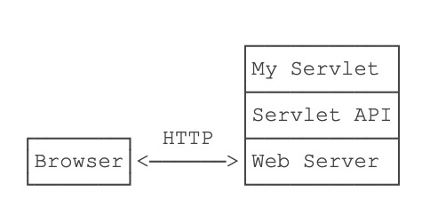
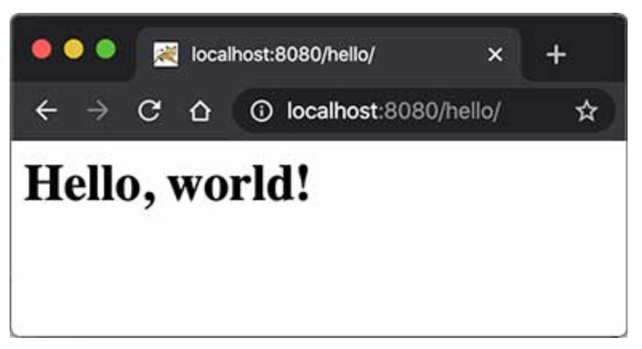

# Servlet入门


通过 **JAVA网络编程** 章节的学习，编写HTTP服务器其实是非常简单的，只需要先编写基于多线程的TCP服务，然后在一个TCP连接中 **1>读取HTTP请求**，**2>发送HTTP响应** 即可。


但是，要编写一个完善的HTTP服务器，以HTTP/1.1为例，需要考虑的包括：

- 识别正确和错误的HTTP请求；
- 识别正确和错误的HTTP头；
- 复用TCP连接；
- 复用线程；
- IO异常处理；
- ......


这些基础工作需要耗费大量的时间，并且经过长期测试才能稳定运行。如果我们只需要输出一个简单的HTML页面，就不得不编写上千行底层代码，那就根本无法做到高效而可靠地开发。


因此，在JavaEE平台上，处理TCP连接，解析HTTP协议这些底层工作统统扔给现成的Web服务器去做，我们只需要把自己的应用程序跑在Web服务器上。为了实现这一目的，JavaEE提供了 ***Servlet API***，我们使用Servlet API编写自己的Servlet来处理HTTP请求，Web服务器实现Servlet API接口，实现底层功能：



简单的Servlet示例：

```java
// WebServlet注解表示这是一个Servlet，并映射到地址/:
@WebServlet(urlPatterns = "/")
public class HelloServlet extends HttpServlet {
    protected void doGet(HttpServletRequest req, HttpServletResponse resp)
            throws ServletException, IOException {
        // 设置响应类型:
        resp.setContentType("text/html");
        // 获取输出流:
        PrintWriter pw = resp.getWriter();
        // 写入响应:
        pw.write("<h1>Hello, world!</h1>");
        // 最后不要忘记flush强制输出:
        pw.flush();
    }
}
```


Servlet API是一个jar包，我们需要通过Maven来引入它，才能正常编译。编写`pom.xml`文件如下：

```xml
<project xmlns="http://maven.apache.org/POM/4.0.0"
    xmlns:xsi="http://www.w3.org/2001/XMLSchema-instance"
    xsi:schemaLocation="http://maven.apache.org/POM/4.0.0 http://maven.apache.org/maven-v4_0_0.xsd">
    <modelVersion>4.0.0</modelVersion>
    <groupId>com.itranswarp.learnjava</groupId>
    <artifactId>web-servlet-hello</artifactId>
    <packaging>war</packaging>
    <version>1.0-SNAPSHOT</version>

    <properties>
        <project.build.sourceEncoding>UTF-8</project.build.sourceEncoding>
        <project.reporting.outputEncoding>UTF-8</project.reporting.outputEncoding>
        <maven.compiler.source>11</maven.compiler.source>
        <maven.compiler.target>11</maven.compiler.target>
        <java.version>11</java.version>
    </properties>

    <dependencies>
        <dependency>
            <groupId>javax.servlet</groupId>
            <artifactId>javax.servlet-api</artifactId>
            <version>4.0.0</version>
            <scope>provided</scope>
        </dependency>
    </dependencies>

    <build>
        <finalName>hello</finalName>
    </build>
</project>
```


注意到这个`pom.xml`与前面我们讲到的普通Java程序有个区别，打包类型不是`jar`，而是`war`，表示Java Web Application Archive：

```xml
<packaging>war</packaging>
```


打包文件可以通过```<finalName>```标签指定：

```xml
<finalName>test</finalName>
```


还需要在工程目录下创建一个`web.xml`描述文件，放到`src/main/webapp/WEB-INF`目录下（固定目录结构，不要修改路径，注意大小写）。文件内容可以固定如下：

```xml
<!DOCTYPE web-app PUBLIC
 "-//Sun Microsystems, Inc.//DTD Web Application 2.3//EN"
 "http://java.sun.com/dtd/web-app_2_3.dtd">
<web-app>
  <display-name>Archetype Created Web Application</display-name>
</web-app>
```


运行Maven命令`mvn clean package`，在`target`目录下得到一个`hello.war`文件，这个文件就是我们编译打包后的Web应用程序。


普通的Java程序是通过启动JVM，然后执行`main()`方法开始运行。但是Web应用程序有所不同，我们无法直接运行`war`文件，必须先启动Web服务器，再由Web服务器加载我们编写的`HelloServlet`，这样就可以让`HelloServlet`处理浏览器发送的请求。


因此，我们首先要找一个支持Servlet API的Web服务器。常用的服务器有：

- [Tomcat](https://tomcat.apache.org/)：由Apache开发的开源免费服务器
- [Jetty](https://www.eclipse.org/jetty/)：由Eclipse开发的开源免费服务器；
- [GlassFish](https://javaee.github.io/glassfish/)：一个开源的全功能JavaEE服务器。


无论使用哪个服务器，只要它支持Servlet API 4.0（因为我们引入的Servlet版本是4.0），我们的war包都可以在上面运行。这里我们选择使用最广泛的开源免费的Tomcat服务器。


要运行我们的`hello.war`，首先要[下载Tomcat服务器](https://tomcat.apache.org/download-90.cgi)，解压后，把`hello.war`复制到Tomcat的`webapps`目录下，然后切换到`bin`目录，执行`startup.sh`或`startup.bat`启动Tomcat服务器：


```sh
$ ./startup.sh 
Using CATALINA_BASE:   .../apache-tomcat-9.0.30
Using CATALINA_HOME:   .../apache-tomcat-9.0.30
Using CATALINA_TMPDIR: .../apache-tomcat-9.0.30/temp
Using JRE_HOME:        .../jdk-11.jdk/Contents/Home
Using CLASSPATH:       .../apache-tomcat-9.0.30/bin/bootstrap.jar:...
Tomcat started.
```


在浏览器输入`http://localhost:8080/hello/`即可看到`HelloServlet`的输出：




在Servlet容器中运行的Servlet具有如下特点：

- 无法在代码中直接通过new创建Servlet实例，必须由Servlet容器自动创建Servlet实例；
- Servlet容器只会给每个Servlet类创建唯一实例；
- Servlet容器会使用多线程执行`doGet()`或`doPost()`方法。