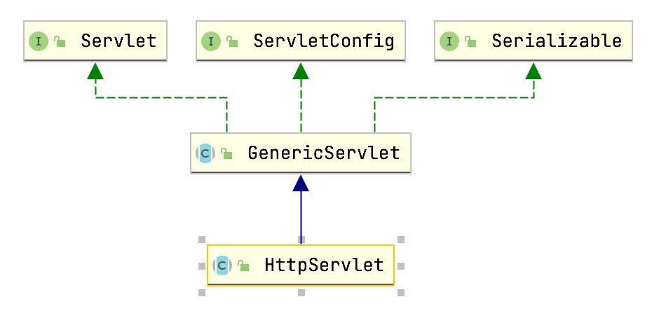
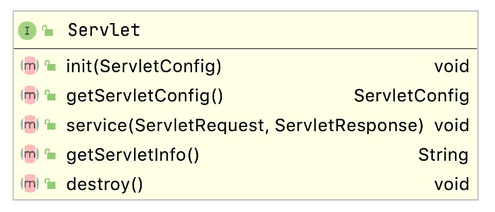
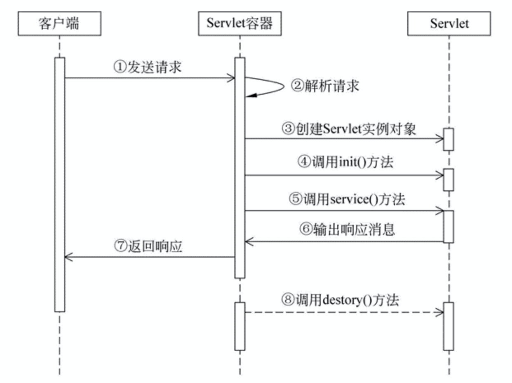

# Servlet开发


## Servlet接口

```Servlet``` 接口是 Servlet API的最核心抽象类。所有的 servlets 要么直接实现了这个接口，或者以更通用的方式继承实现了这个接口的类。Servlet API自带了两个实现了Servlet接口的类：```GenericServlet``` 和 ```HttpServlet```。绝大多数情况下，开发人员都会继承HttpServlet来开发servlets。




### 请求处理方法

最基本的 ***Servlet*** 接口定义了一个 ```service``` 方法来处理客户端请求。servlet容器把每一个请求都路由到对应的Servlet中，然后调用这个方法。值得注意的是，开发人员需要自行设计servlets以满足对并发请求的处理要求。通常情况下，Web容器通过在不同的线程中并发执行同一个servlet的service方法来实现对并发请求的处理。

```java
protected void service(HttpServletRequest req, HttpServletResponse resp)
        throws ServletException, IOException
    {
        String method = req.getMethod();
				......
        doGet(req, resp);
				......
        } else if (method.equals(METHOD_HEAD)) {
            ......
            doHead(req, resp);
        } else if (method.equals(METHOD_POST)) {
            doPost(req, resp);
        } else if (method.equals(METHOD_PUT)) {
            doPut(req, resp);
        } else if (method.equals(METHOD_DELETE)) {
            doDelete(req, resp);
        } else if (method.equals(METHOD_OPTIONS)) {
            doOptions(req,resp);
        } else if (method.equals(METHOD_TRACE)) {
            doTrace(req,resp);
            
        } else {
					...
            resp.sendError();
        }
    }
```


### HTTP特有的请求处理方法

HttpServlet这个抽象子类在Servlet接口的基础上扩充了几个方法，Servlet处理HTTP请求时service方法会自动调用对应的扩充方法。
方法列表如下：

```
doGet        处理HTTP GET请求

doPost       处理HTTP POST请求

doPut        处理HTTP PUT请求

doDelete     处理HTTP DELETE请求

doHead       处理HTTP HEAD请求

doOptions    处理HTTP OPTIONS请求

doTrace      处理HTTP TRACE请求
```


一般情况下，开发人员编写基于HTTP的servlets时只写好 ***doGet*** 和 ***doPost*** 方法就足够了。其他的几个方法只有特别熟悉HTTP协议的人员才有可能用得到。


### 生命周期

`Servlet` 是按照一个严格定义的生命周期被管理，该生命周期规定了Servlet 如何被加载、实例化、初始化、处理客户端请求，以及何时结束服务。该声明周期可以通过 javax.servlet.Servlet 接口中的 ```init```、```service``` 和 ```destroy``` 这些 API 来表示，所有 Servlet 必须直接或间接的实现 GenericServlet 或 HttpServlet 抽象类。



与 Servlet 生命周期有关的方法一般有以下三个：

***1. init()***

init() 方法是在创建 Servlet 对象时被调用，而且只能被调用一次，用于 Servlet 对象在整个生命周期内的唯一一次初始化。只有在 init() 方法调用成功后，Servlet 才会处于服务状态，才能够去处理客户端的请求。


***2. service()***

service() 方法是 Servlet 工作的核心方法。当客户端请求访问 Servlet 时，Servlet 容器就会调用 service() 方法去处理来自客户端的请求，并把处理后的响应返回给客户端。


***3. destroy()***

destory() 方法是 Servlet 容器回收 Servlet 对象之前调用的，且只会调用一次，而此时的服务器处于停止状态或者访问资源已经被移除。


Servlet 的生命周期大概流程如下所示：



**说明：**

按照功能的不同，大致可以将 Servlet 的生命周期分为三个阶段，分别是***初始化阶段***、***运行阶段***和***销毁阶段***。


***初始化阶段***

当用户第一次向 Servlet 容器发出 HTTP 请求要求访问某个 Servlet 时，Servlet 容器会在整个容器中搜索该 Servlet 对象，发现这个 Servlet 对象没有被实例化，于是创建这个 Servlet 对象，然后调用该对象的 init() 方法完成初始化。

当用户第二次访问这个 Servlet 时，Servlet 容器仍然在容器中搜索该 Servlet 对象，结果找到了该对象的实例，则不去创建而直接使用该对象。

找到了对应的 Servlet 对象，随后 Servlet 进入到运行阶段。

**需要注意的是，在 Servlet 的整个生命周期内，它的 init() 方法只被调用一次**。


***运行阶段***

这是 Servlet 生命周期中最核心的阶段。在该阶段中，Servlet 容器会为当前的请求创建一个 ServletRequest 对象和一个 ServletResponse 对象（它们分别代表 HTTP 请求和 HTTP 响应），并将这两个对象作为参数传递给 Servlet 的 service() 方法。

service() 方法从 ServletRequest 对象中获得用户的详细请求信息并处理该请求，通过 ServletResponse 对象生成响应结果。

需要强调的是，在 Servlet 的整个生命周期内，用户每次请求访问 Servlet 时，Servlet 容器都会调用一次 Servlet 的 service() 方法，并且创建新的 ServletRequest 和 ServletResponse 对象。


***销毁阶段***

当服务器停止时，Servlet 容器需要回收 Servlet 对象所占用的内存，在回收之前，会自动调用该对象的 destroy() 方法做好回收内存前的准备，辟如关闭后台线程。

和 init() 方法类似，destroy() 方法也只会被调用一次。

**注意：** Servlet 对象一旦创建就会驻留在内存中一直等待客户端的访问，直到服务器关闭或项目被移除出容器时，Servlet 对象才会被销毁。


***总结***

对 Servlet 声明周期的几点汇总：

1. Servlet 对象被创建之后执行 init() 方法，并且 init() 方法只执行一次，其主要目的是完成 Servlet 对象的初始化工作。
2. 对于 Servlet 对象的 service() 方法，只要用户请求一次，那么 service() 方法就执行一次。
3. Servlet 对象被回收之前，destroy() 方法会被调用，该方法只执行一次，执行的时候 Servlet 对象还在。


Servlet 对象的创建、对象提供服务、对象的销毁等操作皆由 Servlet 容器来管理，Java 程序员的任务只是负责编写 Servlet 类，无法干涉 Servlet 对象的生命周期。


## 请求

请求对象 (```HttpServletRequest```) 封装了客户端请求的所有信息。在 HTTP 协议中，这些信息是从客户端发送到服务器请求的 HTTP 头部和消息体。

### HTTP 协议参数

servlet 的请求参数以字符串的形式作为请求的一部分从客户端发送到 servlet 容器。ServletRequest 接口的下列方法可访问这些参数：

* getParameter(name)
* getParameterNames
* getParameterValues
* getParameterMap


***getParameter***

获取指定参数对应的值


***getParameterNames***

获取所有的参数，返回一个可迭代对象


***getParameterValues*** 

获取参数对应的所有值，返回一个可迭代对象


***getParameterMap***

获取所有的参数值，返回一个Map对象


### Headers

通过下面的 HttpServletRequest 接口方法，servlet 可以访问 HTTP 请求的头信息：

* getHeader
* getHeaders
* getHeaderNames

getHeader 方法返回给定头名称的头。多个头可以具有相同的名称，例如HTTP 请求中的 Cache-Control 头。如果多个头的名称相同，getHeader方法返回请求中的第一个头。 getHeaders 方法允许访问所有与特定头名称相关的头值，返回一个 String 对象的 Enumeration（枚举）。
头可包含由 String 形式的 int 或 Date 数据。HttpServletRequest接口提供如下方便的方法访问这些类型的头数据：

* getIntHeader
* getDateHeader

如果 getIntHeader 方法不能转换为 int 的头值，则抛出NumberFormatException 异常。如果 getDateHeader 方法不能把头转换成一个 Date 对象，则抛出 IllegalArgumentException 异常。


### 请求路径元素

引导 servlet 服务请求的请求路径由许多重要部分组成。以下元素从请求URI路径得到，并通过请求对象公开：

* Context Path：与ServletContext相关联的路径前缀是这个Servlet 的一部分。如果这个上下文是基于Web服务器的URL命名空间基础上的“默认”上下文，那么这个路径将是一个空字符串。否则，如果上下文不是基于服务器的命名空间，那么这个路径以“/”字符开始，但不以“/”字符结束。
* Servlet Path：路径部分直接与激活请求的映射对应。这个路径以“/”字符开头，如果请求与“/*”或“”模式匹配，在这种情况下，它是一个空字符串。
* PathInfo：请求路径的一部分，不属于Context Path或Servlet Path。如果没有额外的路径，它要么是null，要么是以“/”开头的字符串。

使用 HttpServletRequest 接口中的下面方法来访问这些信息：

* getContextPath
* getServletPath
* getPathInfo

重要的是要注意，除了请求 URI 和路径部分的 URL 编码差异外，下面的等式永远为真：

```
requestURI = contextPath + servletPath + pathInfo
```


### 其他常用方法

- getMethod()：返回请求方法，例如，`"GET"`，`"POST"`；
- getRequestURI()：返回请求路径，但不包括请求参数，例如，`"/hello"`；
- getQueryString()：返回请求参数，例如，`"name=Bob&a=1&b=2"`；
- getContentType()：获取请求Body的类型，例如，`"application/x-www-form-urlencoded"`；
- getCookies()：返回请求携带的所有Cookie；
- getInputStream()：如果该请求带有HTTP Body，该方法将打开一个输入流用于读取Body；
- getReader()：和getInputStream()类似，但打开的是Reader；
- getRemoteAddr()：返回客户端的IP地址；
- getScheme()：返回协议类型，例如，`"http"`，`"https"`；


## Servlet上下文

ServletContext 接口定义了 servlet 运行在的 Web 应用的视图。容器供应商负责提供 servlet 容器的 ServletContext 接口的实现。servlet 可以使用 ServletContext 对象记录事件，获取 URL 引用的资源，存取当前上下文的其他 servlet 可以访问的属性。


## 响应

`HttpServletResponse`封装了一个HTTP响应。由于HTTP响应必须先发送Header，再发送Body，所以，操作`HttpServletResponse`对象时，必须先调用设置Header的方法，最后调用发送Body的方法。


常用的设置Header的方法有：

- setStatus(sc)：设置响应代码，默认是`200`；
- setContentType(type)：设置Body的类型，例如，`"text/html"`；
- setCharacterEncoding(charset)：设置字符编码，例如，`"UTF-8"`；
- setHeader(name, value)：设置一个Header的值；
- addCookie(cookie)：给响应添加一个Cookie；
- addHeader(name, value)：给响应添加一个Header，因为HTTP协议允许有多个相同的Header；


写入响应时，需要通过`getOutputStream()`获取写入流，或者通过`getWriter()`获取字符流，二者只能获取其中一个。

写入响应前，无需设置`setContentLength()`，因为底层服务器会根据写入的字节数自动设置，如果写入的数据量很小，实际上会先写入缓冲区，如果写入的数据量很大，服务器会自动采用Chunked编码让浏览器能识别数据结束符而不需要设置Content-Length头。

但是，写入完毕后调用`flush()`却是必须的，因为大部分Web服务器都基于HTTP/1.1协议，会复用TCP连接。如果没有调用`flush()`，将导致缓冲区的内容无法及时发送到客户端。此外，写入完毕后千万不要调用`close()`，原因同样是因为会复用TCP连接，如果关闭写入流，将关闭TCP连接，使得Web服务器无法复用此TCP连接。


***示例：***

```java
resp.setContentType("text/html");
PrintWriter pw = resp.getWriter();
pw.write("<h1>Hello, world!</h1>");
pw.flush();
```


***Note:***

写入完毕后对输出流调用flush()而不是close()方法！


