# Servlet进阶

## Cookie 和 Session

HTTP（超文本传输协议）是一个基于请求与响应模式的**无状态协议**。

无状态主要指 2 点：

1. 协议对于事务处理没有记忆能力，服务器不能自动维护用户的上下文信息，无法保存用户状态；
2. 每次请求都是独立的，不会受到前面请求的影响，也不会影响后面的请求。

当浏览器发送 HTTP 请求到服务器时，服务器会响应客户端的请求，但当同一个浏览器再次发送请求到该服务器时，服务器并不知道它就是刚才那个浏览器，即 HTTP 协议的请求**无法保存用户状态**。

通常情况下，用户通过浏览器访问 Web 应用时，服务器都需要保存和跟踪用户的状态。例如，用户在某购物网站结算商品时，Web 服务器必须根据请求用户的身份，找到该用户所购买的商品。由于 HTTP 协议是无协议的，无法保存和跟踪用户状态，所以需要其他的方案来解决问此题，它就是**会话技术**。

### 会话技术

从打开浏览器访问某个网站，到关闭浏览器的过程，称为一次会话。**会话技术是指在会话中，帮助服务器记录用户状态和数据的技术**。

常用的会话技术分为两种：

1. **Cookie** ：客户端会话技术
2. **Session** ：服务端会话技术

### Cookie

Cookie 属于客户端会话技术，它是服务器发送给浏览器的小段文本信息，存储在客户端浏览器的内存中或硬盘上。当浏览器保存了 Cookie 后，每次访问服务器，都会在 HTTP 请求头中将这个 Cookie 回传给服务器。

#### Cookie 的分类

Cookie分为两种：

1. 会话级别 Cookie（默认）：Cookie 保存到浏览器的内存中，浏览器关闭则 Cookie 失效。
2. 持久的 Cookie：Cookie 以文本文件的形式保存到硬盘上。

#### Cookie 的工作流程

Cookie 是基于 HTTP 协议实现的，工作流程如下:

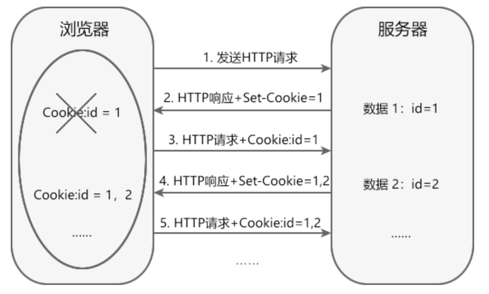

**说明：**

1. 客户端浏览器访问服务器时，服务器通过在 HTTP 响应中增加 Set-Cookie 字段，将数据信息发送给浏览器；
2. 浏览器将 Cookie 保存在内存中或硬盘上；
3. 再次请求该服务器时，浏览器通过在 HTTP 请求消息中增加 Cookie 请求头字段，将 Cookie 回传给 Web 服务器。服务器根据 Cookie 信息跟踪客户端的状态；

#### Cookie API

javax.servlet.http 包中定义了一个 Cookie 类，利用它的带参构造方法，可以创建 Cookie 对象。例如：

```java
Cookie c = new Cookie("url", "Cookie值"); 
```

其中参数 name 为 Cookie 的名称，参数 value 为 Cookie 的值，name 与 value 的取值不能包含 `[ ] ( ) = , " / ? @ : ;`等字符

HttpServletResponse 接口和 HttpServletRequest 接口也都定义了与 Cookie 相关的方法，如下表所示：

| 方法                            | 描述                             | 所属接口                                   |
| ----------------------------- | ------------------------------ | -------------------------------------- |
| void addCookie(Cookie cookie) | 用于在响应头中增加一个相应的 Set-Cookie 头字段。 | javax.servlet.http.HttpServletResponse |
| Cookie[] getCookies()         | 用于获取客户端提交的 Cookie。             | javax.servlet.http.HttpServletRequest  |

javax.servlet.http.Cookie 类中提供了一系列获取或者设置 Cookie 的方法，如下表：

| 返回值类型   | 方法                        | 描述                                                                                                                   |
| ------- | ------------------------- | -------------------------------------------------------------------------------------------------------------------- |
| int     | getMaxAge()               | 用于获取指定 Cookie 的最大有效时间，以秒为单位。 默认情况下取值为 -1，表示该 Cookie 保留到浏览器关闭为止。                                                      |
| String  | getName()                 | 用于获取 Cookie 的名称。                                                                                                     |
| String  | getPath()                 | 用于获取 Cookie 的有效路径。                                                                                                   |
| boolean | getSecure()               | 如果浏览器只通过安全协议发送 Cookie，则返回 true；如果浏览器可以使用任何协议发送 Cookie，则返回 false。                                                     |
| String  | getValue()                | 用于获取 Cookie 的值。                                                                                                      |
| int     | getVersion()              | 用于获取 Cookie 遵守的协议版本。                                                                                                 |
| void    | setMaxAge(int expiry)     | 用于设置 Cookie 的最大有效时间，以秒为单位。 取值为正值时，表示 Cookie 在经过指定时间后过期。取值为负值时，表示 Cookie 不会被持久存储，在 Web 浏览器退出时删除。取值为 0 时，表示删除该 Cookie。 |
| void    | setPath(String uri)       | 用于指定 Cookie 的路径。                                                                                                     |
| void    | setSecure(boolean flag)   | 用于设置浏览器是否只能使用安全协议（如 HTTPS 或 SSL）发送 Cookie。                                                                           |
| void    | setValue(String newValue) | 用于设置 Cookie 的值。                                                                                                      |

#### Cookie 的使用细节

使用 Cookie 开发时需要注意以下细节：

- 一个 Cookie 只能标识一种信息，它至少包含一个名称（NAME）和一个值（VALUE）。
- 如果创建了一个 Cookie，并发送到浏览器，默认情况下它是一个会话级别的 Cookie。用户退出浏览器就被删除。如果希望将 Cookie 存到磁盘上，则需要调用 setMaxAge(int maxAge) 方法设置最大有效时间，以秒为单位。
- 使用 setMaxAge(0) 手动删除 Cookie时，需要使用 setPath 方法指定 Cookie 的路径，且该路径必须与创建 Cookie 时的路径保持一致。

#### Cookie 的缺点

Cookie 虽然可以解决服务器跟踪用户状态的问题，但是它具有以下缺点：

- 在 HTTP 请求中，Cookie 是明文传递的，容易泄露用户信息，安全性不高。
- 浏览器可以禁用 Cookie，一旦被禁用，Cookie 将无法正常工作。
- Cookie 对象中只能设置文本（字符串）信息。
- 客户端浏览器保存 Cookie 的数量和长度是有限制的。

#### 示例

**步骤说明**

1. 获取所有的cookie，判断是否是第一次访问；
2. 如果是第一次访问，输出 ```欢迎光临```，记录当前的时间，回写到浏览器；
3. 如果不是第一次访问，获取时间，输出```欢迎再次光临```，并显示上次访问的时间；

**代码**

```java
import javax.servlet.annotation.WebServlet;
import javax.servlet.http.Cookie;
import javax.servlet.http.HttpServlet;
import javax.servlet.http.HttpServletRequest;
import javax.servlet.http.HttpServletResponse;
import java.io.IOException;
import java.io.PrintWriter;
import java.net.URLDecoder;
import java.net.URLEncoder;
import java.text.SimpleDateFormat;
import java.util.Date;

@WebServlet(urlPatterns = "/cookie")
public class CookieServlet extends HttpServlet {

    @Override
    protected void doGet(HttpServletRequest req, HttpServletResponse resp) throws IOException {

        resp.setContentType("text/html;charset=UTF-8");

        Cookie[] cookies = req.getCookies();
        Cookie cookie = null;
        for (Cookie item : cookies){
            if (item.getName().equals("lastTime")){
                cookie = item;
                break;
            }
        }

        PrintWriter writer = resp.getWriter();
        if (cookie == null){
            writer.print("<h1>欢迎光临</h1>");
        }
        else
        {
            String time = cookie.getValue();
            writer.println("<h1>欢迎再次光临</h1>");
            writer.print("<h3>您上次访问的时间："+ URLDecoder.decode(time) +"</h3>");
        }

        SimpleDateFormat dateFormat = new SimpleDateFormat("yyyy-MM-dd HH:mm:ss");
        String data = dateFormat.format(new Date());

        Cookie dataCookie = new Cookie("lastTime", URLEncoder.encode(data));
        dataCookie.setMaxAge(60*60);
        resp.addCookie(dataCookie);
    }
}
```

**效果**

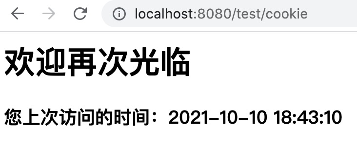

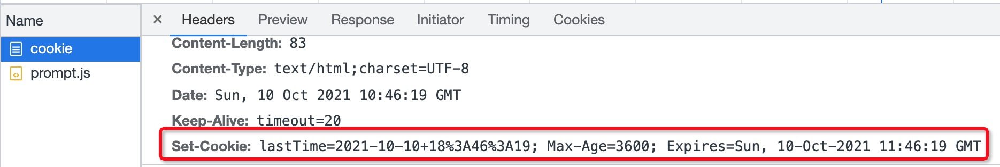

### Session

Session 是服务器端会话技术。当浏览器访问 Web 服务器的资源时，服务器可以为每个用户浏览器创建一个 Session 对象，每个浏览器独占一个 Session 对象。

由于每个浏览器独占一个 Session，所以用户在访问服务器的资源时，可以把数据保存在各自的 Session 中。当用户再次访问该服务器中的其它资源时，其它资源可以从 Session 中取出数据，为用户服务。

#### Session 的工作原理

Session 虽然属于服务端会话技术，但是它的实现离不开客户端浏览器和 Cookie 的支持，其工作原理如下：

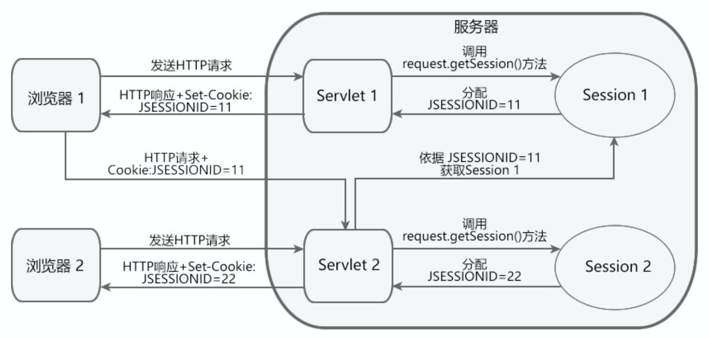

**说明：**

1. 当客户端第一次请求会话对象时，服务器会创建一个 Session 对象，并为该 Session 对象分配一个唯一的 SessionID（用来标识这个 Session 对象）；
2. 服务器将 SessionID 以 Cookie（Cookie 名称为：“JSESSIONID”，值为 SessionID 的值）的形式发送给客户端浏览器；
3. 客户端浏览器再次发送 HTTP 请求时，会将携带 SessionID 的 Cookie 随请求一起发送给服务器；
4. 服务器从请求中读取 SessionID，然后根据 SessionID 找到对应的 Session 对象。

**注意：**

- 流程中的 Cookie 是容器自动生成的，它的 maxAge 属性取值为 -1，表示仅当前浏览器有效。
- 浏览器关闭时，对应的 Session 并没有失效，但此时与此 Session 对应的 Cookie 已失效，导致浏览器无法再通过 Cookie 获取服务器端的 Session 对象。
- 同一浏览器的不同窗口共享同一 Session 对象，但不同浏览器窗口之间不能共享 Session 对象。

#### Session 与 Cookie 对比

Session 和 Cookie 都属于会话技术，都能帮助服务器保存和跟踪用户状态，但两者也存在差异，如下表：

| 不同点         | Cookie                                              | Session                                                   |
| ----------- | --------------------------------------------------- | --------------------------------------------------------- |
| 存储位置不同      | Cookie 将数据存放在客户端浏览器内存中或硬盘上。                         | Session 将数据存储在服务器端。                                       |
| 大小和数量限制不同   | 浏览器对 Cookie 的大小和数量有限制。                              | Session 的大小和数量一般不受限制。                                     |
| 存放数据类型不同    | Cookie 中保存的是字符串。                                    | Session 中保存的是对象。                                          |
| 安全性不同       | Cookie 明文传递，安全性低，他人可以分析存放在本地的 Cookie 并进行 Cookie 欺骗。 | Session 存在服务器端，安全性较高。                                     |
| 对服务器造成的压力不同 | Cookie 保存在客户端，不占用服务器资源。                             | Session 保存在服务端，每一个用户独占一个 Session。若并发访问的用户十分多，就会占用大量服务端资源。 |
| 跨域支持上不同     | Cookie 支持跨域名访问。                                     | Session 不支持跨域名访问。                                         |

#### Session API

Session 对象由服务器创建，通过 HttpServletRequest.getSession() 方法可以获得 HttpSession 对象，例如：

```java
//获取session对象
HttpSession session=request.getSession();
```

HttpSession 接口定义了一系列对 Session 对象操作的方法，如下表:

| 返回值类型          | 方法                                   | 描述                                                    |
| -------------- | ------------------------------------ | ----------------------------------------------------- |
| long           | getCreationTime()                    | 返回创建 Session 的时间。                                     |
| String         | getId()                              | 返回获取 Seesion 的唯一的 ID。                                 |
| long           | getLastAccessedTime()                | 返回客户端上一次发送与此 Session 关联的请求的时间。                        |
| int            | getMaxInactiveInterval()             | 返回在无任何操作的情况下，Session 失效的时间，以秒为单位。                     |
| ServletContext | getServletContext()                  | 返回 Session 所属的 ServletContext 对象。                     |
| void           | invalidate()                         | 使 Session 失效。                                         |
| void           | setMaxInactiveInterval(int interval) | 指定在无任何操作的情况下，Session 失效的时间，以秒为单位。负数表示 Session 永远不会失效。 |

#### 设置 Session 过期时间

Session 对象在服务器中驻留一段时间后没有被使用，就会被销毁，这个时间就是 Session 的过期时间。

Session 的默认过期时间为 30 分钟，我们可以通过如下两种方式设置过期时间。

1. 使用 ```<session-config> ```元素

在 web.xml 中，使用 ```<session-config>``` 及其子元素 ```<session-timeout>``` 可以配置 Session 的默认过期时间，代码如下:

```xml
<?xml version="1.0" encoding="UTF-8"?>
<web-app version="2.5" xmlns="http://java.sun.com/xml/ns/javaee"
         xmlns:xsi="http://www.w3.org/2001/XMLSchema-instance"
         xsi:schemaLocation="http://java.sun.com/xml/ns/javaee
http://java.sun.com/xml/ns/javaee/web-app_2_5.xsd">
    <!--设置session的过期时间-->
    <session-config>
        <session-timeout>10</session-timeout>
    </session-config>
</web-app>
```

其中：

- ```<session-timeout>``` 元素用来指定默认 Session 过期时间，以分钟为单位，该元素值必须为整数。
- ```<session-timeout>``` 元素的值为零或负数，表示 Session 永远不会过期。
2. 调用 setMaxInactiveInterval() 方法

通过调用 session.setMaxInactiveInterval(int interval) 设置过期时间，以秒为单位，零和负数表示会话永远不会过期，代码如下:

```java
//设置会话的过期时间
request.getSession().setMaxInactiveInterval(100);
```

#### 示例

1. 模拟一个登录页面，将输入的用户名保存在Session中；

```java
import javax.servlet.ServletException;
import javax.servlet.annotation.WebServlet;
import javax.servlet.http.HttpServlet;
import javax.servlet.http.HttpServletRequest;
import javax.servlet.http.HttpServletResponse;
import java.io.IOException;
import java.io.PrintWriter;

@WebServlet(urlPatterns = "/signin")
public class SignInServlet extends HttpServlet {

    @Override
    protected void doGet(HttpServletRequest req, HttpServletResponse resp) throws ServletException, IOException {

        resp.setContentType("text/html;charset=UTF-8");
        resp.setCharacterEncoding("UTF-8");

        PrintWriter pw = resp.getWriter();
        pw.write("<h1>登录</h1>");
        pw.write("<form action=\"/test/signin\" method=\"post\">");
        pw.write("<p>用户名: <input name=\"username\"></p>");
        pw.write("<p>密码: <input name=\"password\" type=\"password\"></p>");
        pw.write("<p><button type=\"submit\">登录</button> <a href=\"/\">取消</a></p>");
        pw.write("</form>");
        pw.flush();
    }

    // POST请求时处理用户登录:
    protected void doPost(HttpServletRequest req, HttpServletResponse resp) throws IOException {
        String name = req.getParameter("username");
        String password = req.getParameter("password");
        if (name != null && password != null) {
            // 登录成功:
            req.getSession().setAttribute("user", name);
            resp.sendRedirect(req.getContextPath() + "/index");
        } else {
            resp.sendError(HttpServletResponse.SC_FORBIDDEN);
        }
    }
}
```

上述`SignInServlet`在判断用户登录成功后，立刻将用户名放入当前`HttpSession`中：

```java
HttpSession session = req.getSession();
session.setAttribute("user", name);
```

2. 在`IndexServlet`中，可以从`HttpSession`取出用户名：

```java
import javax.servlet.ServletException;
import javax.servlet.annotation.WebServlet;
import javax.servlet.http.HttpServlet;
import javax.servlet.http.HttpServletRequest;
import javax.servlet.http.HttpServletResponse;
import java.io.IOException;
import java.io.PrintWriter;

@WebServlet(urlPatterns = "/index")
public class IndexServlet extends HttpServlet {
    protected void doGet(HttpServletRequest req, HttpServletResponse resp) throws ServletException, IOException {
        // 从HttpSession获取当前用户名:
        String user = (String) req.getSession().getAttribute("user");
        resp.setContentType("text/html");
        resp.setCharacterEncoding("UTF-8");
        PrintWriter pw = resp.getWriter();
        pw.write("<h1>欢迎, " + (user != null ? user : "游客") + "</h1>");
        if (user == null) {
            // 未登录，显示登录链接:
            pw.write("<p><a href=\"/signin\">登录</a></p>");
        } else {
            // 已登录，显示登出链接:
            pw.write("<p><a href=\"/signout\">退出</a></p>");
        }
        pw.flush();
    }
}
```

3. 如果用户已登录，可以通过访问`/signout`登出。登出逻辑就是从`HttpSession`中移除用户相关信息：

```java
import javax.servlet.ServletException;
import javax.servlet.annotation.WebServlet;
import javax.servlet.http.HttpServlet;
import javax.servlet.http.HttpServletRequest;
import javax.servlet.http.HttpServletResponse;
import java.io.IOException;

@WebServlet(urlPatterns = "/signout")
public class SignOutServlet extends HttpServlet {
    protected void doGet(HttpServletRequest req, HttpServletResponse resp) throws ServletException, IOException {
        // 从HttpSession移除用户名:
        req.getSession().removeAttribute("user");
        resp.sendRedirect(req.getContextPath() + "/signin");
    }
}
```

## 分发请求

构建 Web 应用时，把请求转发给另一个 servlet 处理、或在请求中包含另一个 servlet 的输出通常是很有用的，servlet中提供 **重定向** 和 **转发** 两种机制来实现。

### 重定向

重定向是指当浏览器请求一个URL时，服务器返回一个重定向指令，告诉浏览器地址已经变了，麻烦使用新的URL再重新发送新请求。

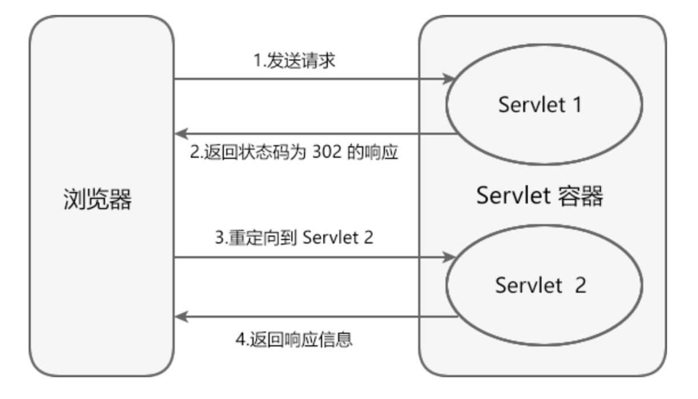

例如，我们已经编写了一个能处理`/hello`的`HelloServlet`，如果收到的路径为`/hi`，希望能重定向到`/hello`，可以再编写一个`RedirectServlet`：

```java
@WebServlet(urlPatterns = "/hi")
public class RedirectServlet extends HttpServlet {
    protected void doGet(HttpServletRequest req, HttpServletResponse resp) throws ServletException, IOException {
        // 构造重定向的路径:
        String name = req.getParameter("name");
        String redirectToUrl = "/hello" + (name == null ? "" : "?name=" + name);
        // 发送重定向响应:
        resp.sendRedirect(redirectToUrl);
    }
}
```

如果浏览器发送`GET /hi`请求，`RedirectServlet`将处理此请求。由于`RedirectServlet`在内部又发送了重定向响应，因此，浏览器会收到如下响应：

```
HTTP/1.1 302 Found
Location: /hello
```

当浏览器收到302响应后，它会立刻根据`Location`的指示发送一个新的`GET /hello`请求，这个过程就是重定向：

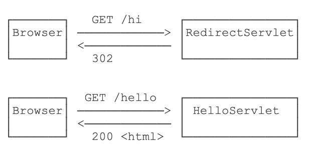

观察Chrome浏览器的网络请求，可以看到两次HTTP请求：

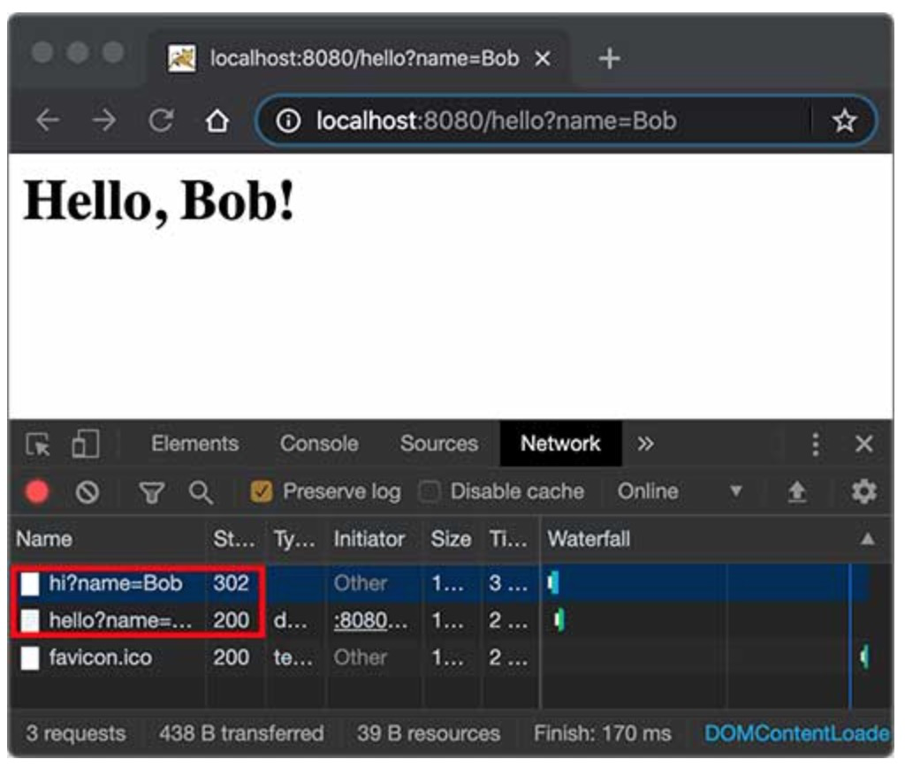

### 转发

Forward是指**内部转发**。当一个Servlet处理请求的时候，它可以决定自己不继续处理，而是转发给另一个Servlet处理。

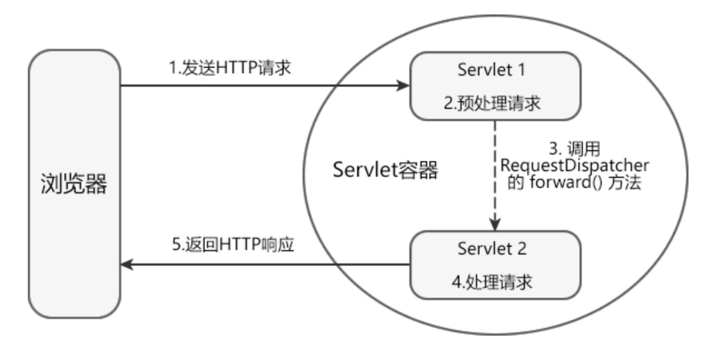

例如，我们已经编写了一个能处理`/hello`的`HelloServlet`，继续编写一个能处理`/morning`的`ForwardServlet`：

```java
@WebServlet(urlPatterns = "/morning")
public class ForwardServlet extends HttpServlet {
    protected void doGet(HttpServletRequest req, HttpServletResponse resp) throws ServletException, IOException {
        req.getRequestDispatcher("/hello").forward(req, resp);
    }
}
```

`ForwardServlet`在收到请求后，它并不自己发送响应，而是把请求和响应都转发给路径为`/hello`的Servlet，即下面的代码：

```java
req.getRequestDispatcher("/hello").forward(req, resp);
```

后续请求的处理实际上是由`HelloServlet`完成的。这种处理方式称为转发（Forward），我们用流程图画出来如下：

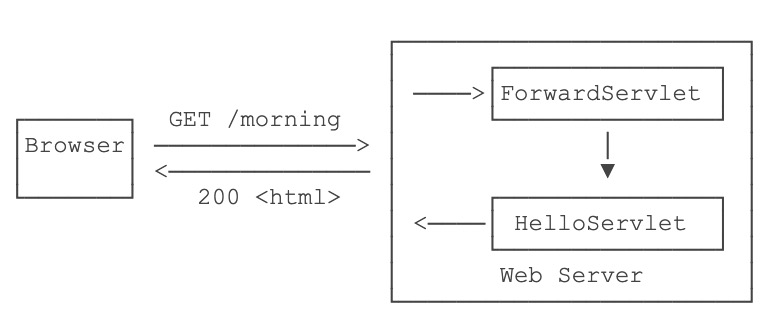

转发和重定向的区别在于，转发是在Web服务器内部完成的，对浏览器来说，它只发出了一个HTTP请求：

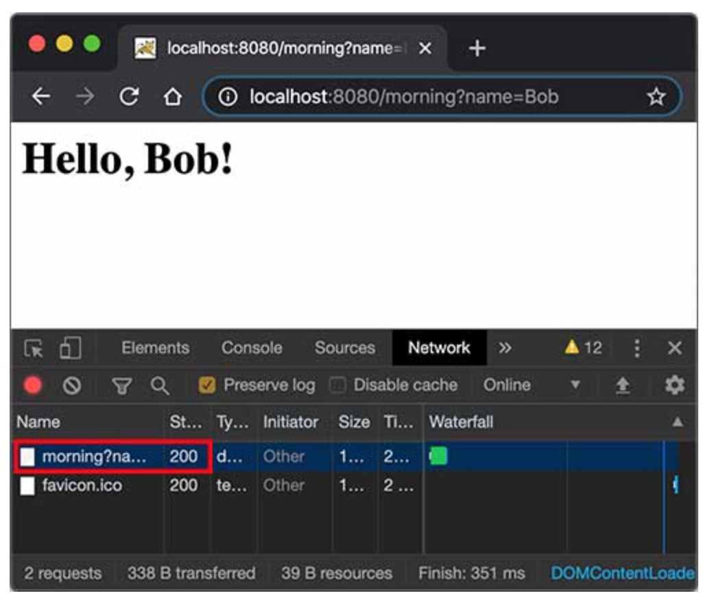

**注意到使用转发的时候，浏览器的地址栏路径仍然是`/morning`，浏览器并不知道该请求在Web服务器内部实际上做了一次转发。**

### 转发和重定向的区别

| 区别                           | 转发        | 重定向       |
|:----------------------------:|:---------:|:---------:|
| 浏览器地址栏 URL 是否发生改变            | 否         | 是         |
| 行为类型                         | 服务器行为     | 客户端行为     |
| 请求与响应的次数                     | 一次请求和一次响应 | 两次请求和两次响应 |
| 是否共享 request 对象和 response 对象 | 是         | 否         |
| 是否能通过 request 域对象传递数据        | 是         | 否         |
| 速度                           | 相对要快      | 相对要慢      |

## Filter

Servlet Filter 又称 Servlet 过滤器，能够对 Servlet 容器传给 Web 资源的 request 对象和 response 对象进行检查和修改。

Filter 是 Servlet 规范中最实用的技术，通过它可以对服务器管理的所有 Web 资源（例如 JSP、Servlet、静态 HTML 文件、静态图片等）进行拦截，从而实现一些特殊的功能，例如用户的权限控制、过滤敏感词、设置统一编码格式等。

### Filter 接口

与开发 Servlet 需要实现 javax.servlet.Servlet 接口类似，开发过滤器要实现 javax.servlet.Filter 接口，并提供一个公开的不带参的构造方法。在 Filter 接口中，定义了 3 个方法，如下表所示：

| 返回值类型 | 方法                                                                           | 功能描述                                                                                                                                                                                        |
| ----- | ---------------------------------------------------------------------------- | ------------------------------------------------------------------------------------------------------------------------------------------------------------------------------------------- |
| void  | init (FilterConfig filterConfig)                                             | 该方法用于初始化过滤器。                                                                                                                                                                                |
| void  | doFilter(ServletRequest request,SeivletResponse response, FilterChain chain) | 该方法完成实际的过滤操作，当客户端请求的 URL 与过滤器映射的 URL 匹配时，容器会先调用该方法对请求进行拦截。 参数 request 和 response 表示请求和响应对象。 参数 chain 代表当前 Filter 链对象，在该方法内部，调用 chain.doFilter() 方法，才能把请求交付给 Filter 链中的下一个 Filter 或者 Web 资源。 |
| void  | destroy()                                                                    | 该方法在销毁 Filter 对象之前被调用，用于释放被 Filter 对象占用的资源。                                                                                                                                                 |

### Filter 的工作流程

Filter的工作流程如下：

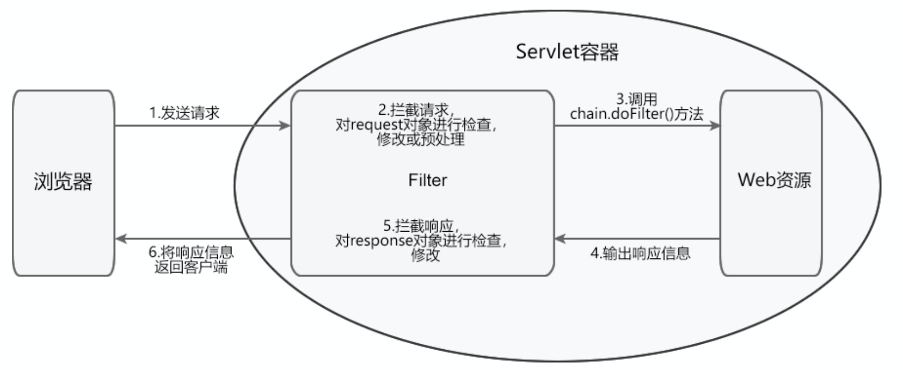

**说明：**

1. 客户端请求访问容器内的 Web 资源。
2. Servlet 容器接收请求，并针对本次请求分别创建一个 request 对象和 response 对象。
3. 请求到达 Web 资源之前，先调用 Filter 的 doFilter() 方法，检查 request 对象，修改请求头和请求正文，或对请求进行预处理操作。
4. 在 Filter 的 doFilter() 方法内，调用 FilterChain.doFilter() 方法，将请求传递给下一个过滤器或目标资源。
5. 目标资源生成响应信息返回客户端之前，处理控制权会再次回到 Filter 的 doFilter() 方法，执行 FilterChain.doFilter() 后的语句，检查 response 对象，修改响应头和响应正文。
6. 响应信息返回客户端。

### Filter 的生命周期

Filter 的生命周期分为 3 个阶段：

1. 初始化阶段
2. 拦截和过滤阶段
3. 销毁阶段

**初始化阶段**

Servlet 容器负责加载和实例化 Filter。容器启动时，读取 web.xml 或 @WebFilter 的配置信息对所有的过滤器进行加载和实例化。

加载和实例化完成后，Servlet 容器调用 init() 方法初始化 Filter 实例。在 Filter 的生命周期内， init() 方法只执行一次。

**拦截和过滤阶段**

该阶段是 Filter 生命周期中最重要的阶段。当客户端请求访问 Web 资源时，Servlet 容器会根据 web.xml 或 @WebFilter 的过滤规则进行检查。当客户端请求的 URL 与过滤器映射匹配时，容器将该请求的 request 对象、response 对象以及 FilterChain 对象以参数的形式传递给 Filter 的 doFilter() 方法，并调用该方法对请求/响应进行拦截和过滤。

**销毁阶段**

Filter 对象创建后会驻留在内存中，直到容器关闭或应用被移除时销毁。销毁 Filter 对象之前，容器会先调用 destory() 方法，释放过滤器占用的资源。在 Filter 的生命周期内，destory() 只执行一次。

### 注册与映射 Filter

注册和映射 Filter 有 2 种方式：

1. 通过 ```web.xml``` 配置
2. 通过 ```@WebFilter``` 注解配置

#### 通过web.xml配置

在 ```web.xml``` 中，通过 ```<filter>``` 及其子元素注册 Filter，代码如下:

```xml
<filter>
    <filter-name>myFilter</filter-name>
    <filter-class>包名.MyFilter</filter-class>

    <filter-mapping>
        <filter-name>myFilter</filter-name>
        <url-pattern>/*</url-pattern>
        <dispatcher>REQUEST</dispatcher>
        <dispatcher>FORWARD</dispatcher>
      </filter-mapping>

</filter>
```

元素说明如下：

- ```<filter>``` 用于注册过滤器
- ```<filter-name>``` 是```<filter>``` 元素的子元素， 用于指定过滤器的注册名，该元素的内容不能为空。
- ```<filter-class>``` 是```<filter>``` 元素的子元素，用于指定过滤器的完整限定名（包名+类名）。
- ```<filter-mapping>``` 元素用于设置 Filter 负责拦截的资源。
- ```<filter-name>``` 是```<filter-mapping>``` 元素的子元素，用于设置 Filter 的注册名，该值必须在 ```<filter>```元素的子元素 ```<filter-name> ```中声明过。
- ```<url-pattern>``` 是```<filter-mapping>``` 元素的子元素，用于**设置 Filter 拦截的请求路径**。
- ```<dispatcher>``` 是```<filter-mapping>``` 元素的子元素，用于指定 Filter 拦截的资源被 Servlet 容器调用的方式，可以是 **REQUEST**、**INCLUDE**、**FORWARD** 和 **ERROR** 之一，默认 REQUEST。用户可以设置多个 ```<dispatcher>``` 子元素指定 Filter 对资源的多种调用方式进行拦截。

```<dispatcher>``` 元素的取值及其意义：

- **REQUEST**：当用户直接访问页面时，容器将会调用过滤器。如果目标资源是通过 RequestDispatcher 的 include() 或 forward() 方法访问，则该过滤器就不会被调用。
- **INCLUDE**：如果目标资源通过 RequestDispatcher 的 include() 方法访问，则该过滤器将被调用。除此之外，该过滤器不会被调用。
- **FORWARD**：如果目标资源通过 RequestDispatcher 的 forward() 方法访问，则该过滤器将被调用，除此之外，该过滤器不会被调用。
- **ERROR**：如果目标资源通过声明式异常处理机制访问，则该过滤器将被调用。除此之外，过滤器不会被调用。

#### 使用 @WebFilter 注解进行配置

```@WebFilter``` 注解也可以对过滤器进行配置，容器在部署应用时，会根据其具体属性配置将相应的类部署为过滤器。

```@WebFilter```注解的参数基本与```web.xml```配置参数一致，示例如下：

```java
@WebFilter(
        dispatcherTypes = {
                DispatcherType.REQUEST,
                DispatcherType.FORWARD,
                DispatcherType.INCLUDE,
                DispatcherType.ERROR
        },
        asyncSupported = true,
        description = "过滤器4",
        urlPatterns = {"/login"})
public class MyFilter implements Filter {
    @Override
    public void doFilter(ServletRequest request, ServletResponse response, FilterChain chain)
            throws IOException, ServletException {
    }
}
```

### 示例

使用过滤器拦截所有请求，并打印每个请求的远程ip和请求时间：

1. 实现Filter接口

```java
public class LogFilter implements Filter {
    public void init(FilterConfig filterConfig) throws ServletException {

    }

    public void doFilter(ServletRequest request, ServletResponse response, FilterChain chain) throws IOException, ServletException {
        String curDate = new Date().toString();
        String address = request.getRemoteAddr();
        System.out.println(curDate + " ip:" + address);
        chain.doFilter(request, response);
    }

    public void destroy() {

    }
}
```

2. 注册Filter

```xml
<!DOCTYPE web-app PUBLIC
        "-//Sun Microsystems, Inc.//DTD Web Application 2.3//EN"
        "http://java.sun.com/dtd/web-app_2_3.dtd">
<web-app>
    <display-name>Archetype Created Web Application</display-name>

    <filter>
        <filter-name>LogFilter</filter-name>
        <filter-class>包名.LogFilter</filter-class>
    </filter>

    <filter-mapping>
        <filter-name>LogFilter</filter-name>
        <url-pattern>/*</url-pattern>
    </filter-mapping>
</web-app>
```

### FilterChain过滤器链

在 Web 应用中，可以部署多个 Filter，若这些 Filter 都拦截同一目标资源，则它们就组成了一个 Filter 链（也称过滤器链）。过滤器链中的每个过滤器负责特定的操作和任务，客户端的请求在这些过滤器之间传递，直到传递给目标资源。

#### Filter 链的拦截过程

Filter 链的拦截过程如下图所示:

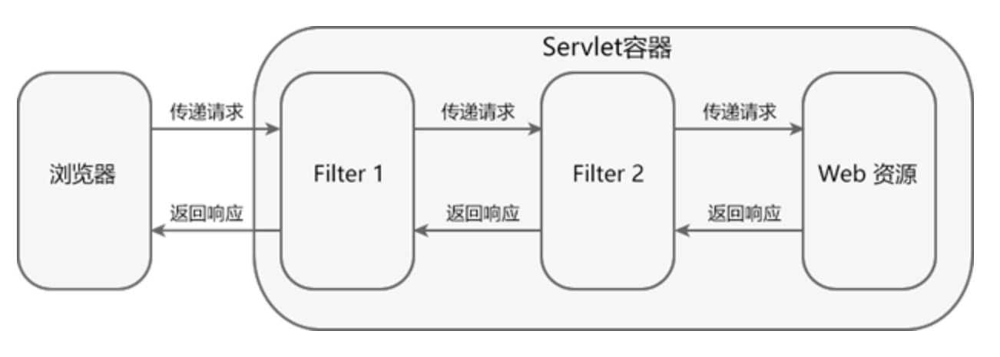

请求资源时，过滤器链中的过滤器依次对请求进行处理，并将请求传递给下一个过滤器，直到最后将请求传递给目标资源。发送响应信息时，则按照相反的顺序对响应进行处理，直到将响应返回给客户端。

过滤器并不是必须要将请求传递到下一个过滤器或目标资源，它可以自行对请求进行处理，并发送响应给客户端，也可以将请求转发给其他的目标资源。

**过滤器链中的任何一个 Filter 没有调用 FilterChain.doFilter() 方法，请求都不会到达目标资源**。

#### Filter 链中 Filter 的执行顺序

通过 web.xml 配置的 Filter 过滤器，执行顺序由 ```<filter-mapping>``` 标签的配置顺序决定。```<filter-mapping> ```靠前，则 Filter 先执行，靠后则后执行。通过修改 ```<filter-mapping>``` 的顺序便可以修改 Filter 的执行顺序。

通过 ```@WebFilter``` 注解配置的 Filter 过滤器，无法进行排序，若需要对 Filter 过滤器进行排序，建议使用 ```web.xml ```进行配置。