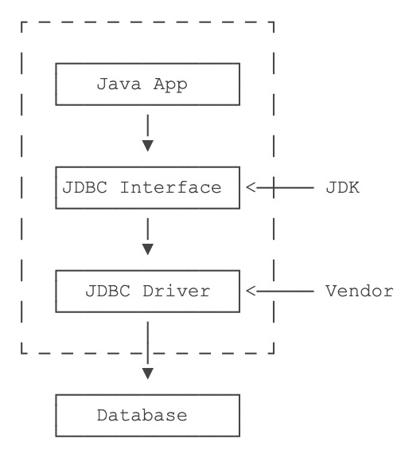
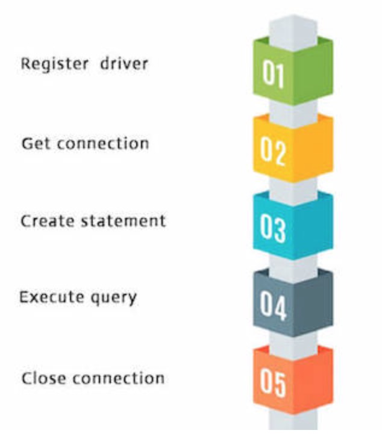
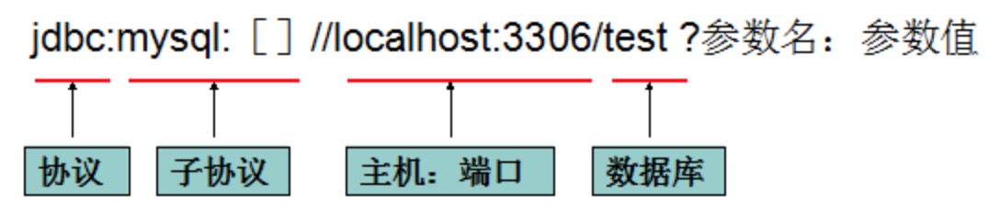
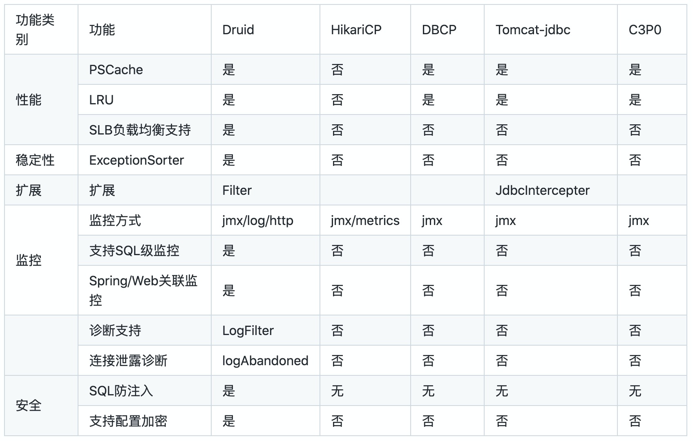

程序运行的时候，往往需要存取数据。现代应用程序最基本，也是使用最广泛的数据存储就是关系数据库。Java为关系数据库定义了一套标准的访问接口：```JDBC```（Java Database Connectivity）。


# JDBC


使用Java程序访问数据库时，Java代码并不是直接通过TCP连接去访问数据库，而是通过JDBC接口来访问，而JDBC接口则通过JDBC驱动来实现真正对数据库的访问。



使用JDBC的好处是：

- 各数据库厂商使用相同的接口，Java代码不需要针对不同数据库分别开发；
- Java程序编译期仅依赖java.sql包，不依赖具体数据库的jar包；
- 可随时替换底层数据库，访问数据库的Java代码基本不变。


### **使用JDBC的步骤**

使用jdbc的步骤主要归结于：



具体步骤为：

1. 注册驱动 (只做一次)

   ```java
   Class.forName("com.mysql.cj.jdbc.Driver").newInstance();
   ```

   

2. 建立连接

   ```java
   Connection conn = DriverManager.getConnection(url, user, password); 
   ```

   URL用于标识数据库的位置，通过URL地址告诉JDBC程序连接哪个数据库，URL的写法为：

   

   假设数据库运行在本机`localhost`，端口使用标准的`3306`，数据库名称是`learnjdbc`，那么URL如下：

   ```shell
   jdbc:mysql://localhost:3306/learnjdbc?serverTimezone=UTC&useUnicode=true&characterEncoding=utf-8
   ```

3. 创建执行SQL语句的statement

   ```java
   String id = "5";
   String sql = "delete from table where id=" +  id;
   Statement st = conn.createStatement();
   st.executeQuery(sql);
   ```

   

   ***Note:***

   以上语句存在危险，如果用户传入的id为“5 or 1=1”，那么将删除表中的所有记录。

   

   ```PreparedStatement``` 有效的防止**sql注**入(SQL语句在程序运行前已经进行了预编译,当运行时动态地把参数传给PreprareStatement时，即使参数里有敏感字符如 or '1=1'也数据库会作为一个参数一个字段的属性值来处理而不会作为一个SQL指令)。

   ```java
   String sql = “insert into user (name,pwd) values(?,?)”;  
   PreparedStatement ps = conn.preparedStatement(sql);  
   ps.setString(1, “col_value”);  //占位符顺序从1开始
   ps.setString(2, “123456”); //也可以使用setObject
   ps.executeQuery(); 
   ```

   


4.  处理执行结果(ResultSet)

   ```java
   ResultSet rs = ps.executeQuery();  
   While(rs.next()){  
       rs.getString(“col_name”);  
       rs.getInt(1);  
       //…
   } 
   ```


5. 释放资源

   ```java
   //数据库连接（Connection）非常耗资源，尽量晚创建，尽量早的释放 //都要加try catch 以防前面关闭出错，后面的就不执行了 1 
   try {
     if (rs != null) {
       rs.close();
     }
   } catch (SQLException e) {
     e.printStackTrace();
   } finally {
     try {
       if (st != null) {
         st.close();
       }
     } catch (SQLException e) {
       e.printStackTrace();
     } finally {
       try {
         if (conn != null) {
           conn.close();
         }
       } catch (SQLException e) {
         e.printStackTrace();
       }
     }
   }
   ```

   

### properties配置文件

java中的properties文件是一种配置文件，主要用于表达配置信息。jdbc需要使用数据库的多个参数，更好的方法是将数据库参数写在配置文件中：

```properties
driver=com.mysql.cj.jdbc.Driver
url=jdbc:mysql://localhost/test_db?useUnicode=true&characterEncoding=utf-8&useSSL=false&allowPublicKeyRetrieval=true&serverTimezone=UTC
user=username
password=your_pwd
```


#### 读取配置文件

- 方式一：

```java
private static final String driver;
private static final String url;
private static final String user;
private static final String pwd;

// 静态代码块
static {
        Properties properties = new Properties();
        InputStream inputStream =  JDBCUtil.class.getClassLoader().getResourceAsStream("db.properties");
        try {
            properties.load(inputStream);

            driver = properties.getProperty("driver");
            url = properties.getProperty("url");
            user = properties.getProperty("user");
            pwd = properties.getProperty("password");

        } catch (IOException e) {
            e.printStackTrace();
        }
    }

```


- 方式二：

```java
private static final String driver;
private static final String url;
private static final String user;
private static final String pwd;

static {
  ResourceBundle bundle = ResourceBundle.getBundle("db");

  driver = bundle.getString("driver");
  url = bundle.getString("url");
  user = bundle.getString("user");
  pwd = bundle.getString("password");
}
```


### 简单封装

```java
import java.sql.*;
import java.util.ResourceBundle;

public class JDBCUtil {

    private static final String driver;
    private static final String url;
    private static final String user;
    private static final String pwd;


    static {
        ResourceBundle bundle = ResourceBundle.getBundle("db");

        driver = bundle.getString("driver");
        url = bundle.getString("url");
        user = bundle.getString("user");
        pwd = bundle.getString("password");
    }


    public static Connection getConnection(){
        Connection connection = null;
        try {
            // 加载驱动
            Class.forName(driver);

            // 获得数据库连接
            connection = DriverManager.getConnection(url, user, pwd);
        } catch (ClassNotFoundException | SQLException e) {
            e.printStackTrace();
        }

        return connection;
    }

    public static void close(Connection connection, Statement statement, ResultSet resultSet){
        closeResultSet(resultSet);
        closeStatement(statement);
        closeConnection(connection);
    }

    public static void closeConnection(Connection connection){
        if (connection != null)
        {
            try {
                connection.close();
            } catch (SQLException throwables) {
                throwables.printStackTrace();
            }
        }
    }

    public static void closeStatement(Statement statement){
        if (statement != null)
        {
            try {
                statement.close();
            } catch (SQLException throwables) {
                throwables.printStackTrace();
            }
        }
    }


    public static void closeResultSet(ResultSet set){
        if (set != null)
        {
            try {
                set.close();
            } catch (SQLException throwables) {
                throwables.printStackTrace();
            }
        }
    }
}
```


### JDBC Batch

使用JDBC操作数据库的时候，经常会执行一些批量操作。例如，一次性给会员增加可用优惠券若干，我们可以执行以下SQL代码：

```sql
INSERT INTO coupons (user_id, type, expires) VALUES (123, 'DISCOUNT', '2030-12-31');
INSERT INTO coupons (user_id, type, expires) VALUES (234, 'DISCOUNT', '2030-12-31');
INSERT INTO coupons (user_id, type, expires) VALUES (345, 'DISCOUNT', '2030-12-31');
INSERT INTO coupons (user_id, type, expires) VALUES (456, 'DISCOUNT', '2030-12-31');
...

```

实际上执行JDBC时，因为只有占位符参数不同，所以SQL实际上是一样的：

```java
for (var params : paramsList) {
    PreparedStatement ps = conn.preparedStatement("INSERT INTO coupons (user_id, type, expires) VALUES (?,?,?)");
    ps.setLong(params.get(0));
    ps.setString(params.get(1));
    ps.setString(params.get(2));
    ps.executeUpdate();
}
```

通过一个循环来执行每个`PreparedStatement`虽然可行，但是性能很低。SQL数据库对SQL语句相同，但只有参数不同的若干语句可以作为 ***batch*** 执行，即批量执行，这种操作有特别优化，速度远远快于循环执行每个SQL。


在JDBC代码中，我们可以利用SQL数据库的这一特性，把同一个SQL但参数不同的若干次操作合并为一个batch执行。我们以批量插入为例，示例代码如下：

```java
try (PreparedStatement ps = conn.prepareStatement("INSERT INTO students (name, gender, grade, score) VALUES (?, ?, ?, ?)")) {
    // 对同一个PreparedStatement反复设置参数并调用addBatch():
    for (Student s : students) {
        ps.setString(1, s.name);
        ps.setBoolean(2, s.gender);
        ps.setInt(3, s.grade);
        ps.setInt(4, s.score);
        ps.addBatch(); // 添加到batch
    }
    // 执行batch:
    int[] ns = ps.executeBatch();
    for (int n : ns) {
        System.out.println(n + " inserted."); // batch中每个SQL执行的结果数量
    }
}
```


执行batch和执行一个SQL不同点在于，需要对同一个`PreparedStatement`反复设置参数并调用`addBatch()`，这样就相当于给一个SQL加上了多组参数，相当于变成了“多行”SQL。

第二个不同点是调用的不是`executeUpdate()`，而是`executeBatch()`，因为我们设置了多组参数，相应地，返回结果也是多个`int`值，因此返回类型是`int[]`，循环`int[]`数组即可获取每组参数执行后影响的结果数量。


## 连接池

在执行JDBC的增删改查的操作时，如果每一次操作都来一次打开连接，操作，关闭连接，那么创建和销毁JDBC连接的开销就太大了。为了避免频繁地创建和销毁JDBC连接，我们可以通过 **连接池**（Connection Pool）复用已经创建好的连接。

JDBC连接池有一个标准的接口`javax.sql.DataSource`，注意这个类位于Java标准库中，但仅仅是接口。要使用JDBC连接池，我们必须选择一个JDBC连接池的实现。常用的JDBC连接池有：

- ***HikariCP***
- C3P0
- BoneCP
- ***Druid***


常用的JDBC连接池对比：




对比说明：

- **功能角度**考虑，Druid 功能更全面，除具备连接池基本功能外，还支持sql级监控、扩展、SQL防注入等。最新版甚至有集群监控

- 单从**性能角度**考虑，从数据上确实HikariCP要强，但Druid有更多、更久的生产实践，它可靠。

- 单从**监控角度**考虑，如果我们有像skywalking、prometheus等组件是可以将监控能力交给这些的 HikariCP 也可以将metrics暴露出去。


目前使用最广泛的是```HikariCP```（SpringBoot内置）。我们以HikariCP为例，要使用JDBC连接池，先添加HikariCP的依赖如下：

***Java 11+*** maven artifact:

```xml
<dependency>
   <groupId>com.zaxxer</groupId>
   <artifactId>HikariCP</artifactId>
   <version>5.0.0</version>
</dependency>
```

***Java 8*** maven artifact (maintenance mode):

```xml
<dependency>
   <groupId>com.zaxxer</groupId>
   <artifactId>HikariCP</artifactId>
   <version>4.0.3</version>
</dependency>
```

***Java 7*** maven artifact (maintenance mode):

```xml
<dependency>
   <groupId>com.zaxxer</groupId>
   <artifactId>HikariCP-java7</artifactId>
   <version>2.4.13</version>
</dependency>
```


紧接着，我们需要创建一个`DataSource`实例，这个实例就是连接池：

```java
HikariConfig config = new HikariConfig();
config.setJdbcUrl("jdbc:mysql://localhost:3306/test");
config.setUsername("root");
config.setPassword("password");
config.addDataSourceProperty("connectionTimeout", "1000"); // 连接超时：1秒
config.addDataSourceProperty("idleTimeout", "60000"); // 空闲超时：60秒
config.addDataSourceProperty("maximumPoolSize", "10"); // 最大连接数：10
DataSource ds = new HikariDataSource(config);
```


注意创建`DataSource`也是一个非常昂贵的操作，所以通常`DataSource`实例总是作为一个全局变量存储，并贯穿整个应用程序的生命周期。

有了连接池以后，我们如何使用它呢？和前面的代码类似，只是获取`Connection`时，把`DriverManage.getConnection()`改为`ds.getConnection()`：

```java 
try (Connection conn = ds.getConnection()) { // 在此获取连接
    ...
} // 在此“关闭”连接
```

通过连接池获取连接时，并不需要指定JDBC的相关URL、用户名、口令等信息，因为这些信息已经存储在连接池内部了（创建`HikariDataSource`时传入的`HikariConfig`持有这些信息）。一开始，连接池内部并没有连接，所以，第一次调用`ds.getConnection()`，会迫使连接池内部先创建一个`Connection`，再返回给客户端使用。当我们调用`conn.close()`方法时（`在try(resource){...}`结束处），不是真正“关闭”连接，而是释放到连接池中，以便下次获取连接时能直接返回。

因此，连接池内部维护了若干个`Connection`实例，如果调用`ds.getConnection()`，就选择一个空闲连接，并标记它为“正在使用”然后返回，如果对`Connection`调用`close()`，那么就把连接再次标记为“空闲”从而等待下次调用。这样一来，我们就通过连接池维护了少量连接，但可以频繁地执行大量的SQL语句。

通常连接池提供了大量的参数可以配置，例如，维护的最小、最大活动连接数，指定一个连接在空闲一段时间后自动关闭等，需要根据应用程序的负载合理地配置这些参数。此外，大多数连接池都提供了详细的实时状态以便进行监控。


[HikariCP](https://github.com/brettwooldridge/HikariCP)


## Druid


[Druid](https://github.com/alibaba/druid)
