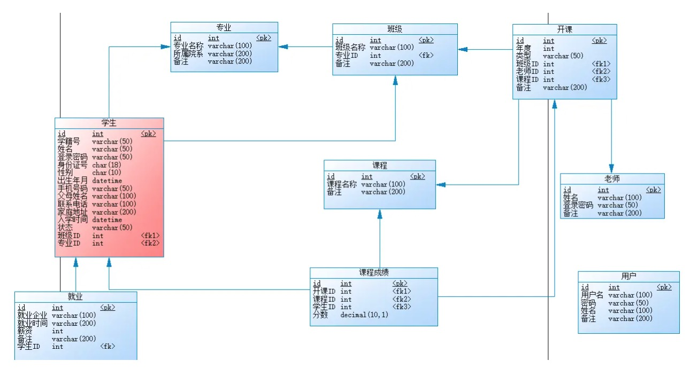
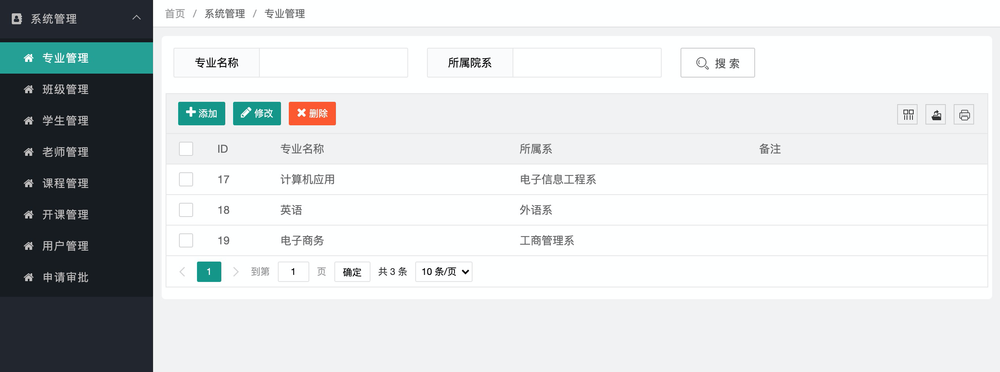
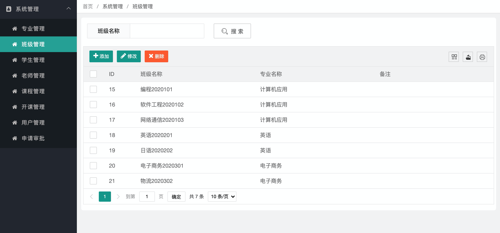
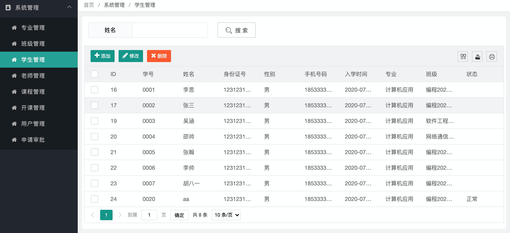
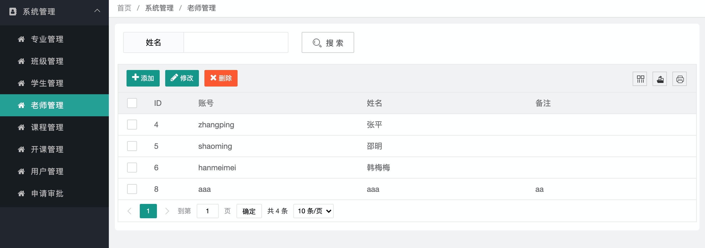
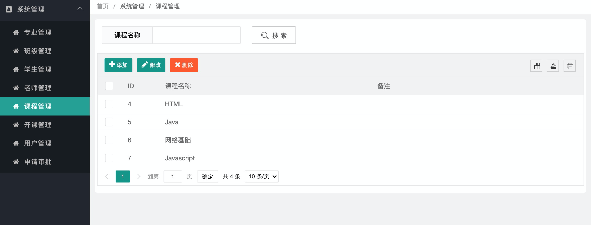
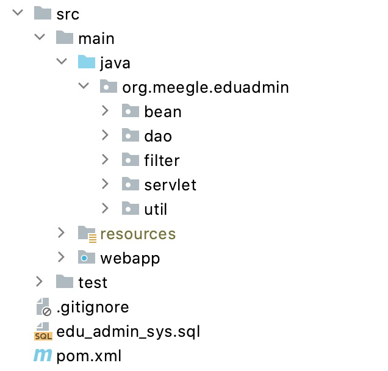

# 教务管理系统

基于 ***Servlet*** +  ***layui*** 的教务管理系统

## 技术路线

- 开发工具：IDEA 2020.1
- 技术框架：Servlet、JSP
- Web容器：Tomcat 9.0.38
- 数据库：MySQL 5.8
- 前端UI框架：LayUI
- 项目管理：Maven 3.6.3

## 系统功能

- 用户登录和退出

- 权限控制

- 系统管理
  
  - 专业管理
  
  - 班级管理
  
  - 学生管理
  
  - 老师管理
  
  - 课程管理
  
  - 开课管理
  
  - 用户管理
  
  - 申请审批

- 老师管理
  
  - 成绩管理
  - 学生查询
  - 申请审批

- 学生管理
  
  - 选课管理
  - 成绩查询

## 数据库设计

数据表E-R图：



SQL脚本：

```sql
/*
 Navicat Premium Data Transfer

 Source Server         : MySQL
 Source Server Type    : MySQL
 Source Server Version : 50717
 Source Host           : localhost:3306
 Source Schema         : edu_admin_sys

 Target Server Type    : MySQL
 Target Server Version : 50717
 File Encoding         : 65001

 Date: 27/10/2021 16:58:11
*/

SET NAMES utf8mb4;
SET FOREIGN_KEY_CHECKS = 0;

-- ----------------------------
-- Table structure for tb_clazz
-- ----------------------------
DROP TABLE IF EXISTS `tb_clazz`;
CREATE TABLE `tb_clazz` (
  `id` int(11) NOT NULL AUTO_INCREMENT,
  `clazz_name` varchar(100) DEFAULT NULL,
  `subject_id` int(11) DEFAULT NULL,
  `remark` varchar(200) DEFAULT NULL,
  PRIMARY KEY (`id`) USING BTREE,
  KEY `FK_Reference_1` (`subject_id`) USING BTREE,
  CONSTRAINT `FK_Reference_1` FOREIGN KEY (`subject_id`) REFERENCES `tb_subject` (`id`)
) ENGINE=InnoDB AUTO_INCREMENT=22 DEFAULT CHARSET=utf8 ROW_FORMAT=DYNAMIC;

-- ----------------------------
-- Records of tb_clazz
-- ----------------------------
BEGIN;
INSERT INTO `tb_clazz` VALUES (15, '编程2020101', 17, '');
INSERT INTO `tb_clazz` VALUES (16, '软件工程2020102', 17, '');
INSERT INTO `tb_clazz` VALUES (17, '网络通信2020103', 17, '');
INSERT INTO `tb_clazz` VALUES (18, '英语2020201', 18, '');
INSERT INTO `tb_clazz` VALUES (19, '日语2020202', 18, '');
INSERT INTO `tb_clazz` VALUES (20, '电子商务2020301', 19, '');
INSERT INTO `tb_clazz` VALUES (21, '物流2020302', 19, '');
COMMIT;

-- ----------------------------
-- Table structure for tb_course
-- ----------------------------
DROP TABLE IF EXISTS `tb_course`;
CREATE TABLE `tb_course` (
  `id` int(11) NOT NULL AUTO_INCREMENT,
  `course_name` varchar(100) DEFAULT NULL,
  `remark` varchar(200) DEFAULT NULL,
  PRIMARY KEY (`id`) USING BTREE
) ENGINE=InnoDB AUTO_INCREMENT=8 DEFAULT CHARSET=utf8 ROW_FORMAT=DYNAMIC;

-- ----------------------------
-- Records of tb_course
-- ----------------------------
BEGIN;
INSERT INTO `tb_course` VALUES (4, 'HTML', '');
INSERT INTO `tb_course` VALUES (5, 'Java', '');
INSERT INTO `tb_course` VALUES (6, '网络基础', '');
INSERT INTO `tb_course` VALUES (7, 'Javascript', '');
COMMIT;

-- ----------------------------
-- Table structure for tb_job
-- ----------------------------
DROP TABLE IF EXISTS `tb_job`;
CREATE TABLE `tb_job` (
  `id` int(11) NOT NULL AUTO_INCREMENT,
  `comp_name` varchar(100) DEFAULT NULL,
  `job_date` varchar(200) DEFAULT NULL,
  `salay` int(11) DEFAULT NULL,
  `remark` varchar(200) DEFAULT NULL,
  `stu_id` int(11) DEFAULT NULL,
  PRIMARY KEY (`id`) USING BTREE,
  KEY `FK_Reference_7` (`stu_id`) USING BTREE
) ENGINE=InnoDB AUTO_INCREMENT=14 DEFAULT CHARSET=utf8 ROW_FORMAT=DYNAMIC;

-- ----------------------------
-- Records of tb_job
-- ----------------------------
BEGIN;
INSERT INTO `tb_job` VALUES (11, '1111', '2111', 3111, '444111', 9);
INSERT INTO `tb_job` VALUES (12, '112', '333', 44, '555', 10);
INSERT INTO `tb_job` VALUES (13, '莫某企业科技公司', '2020-07-01', 15000, '薪水', 11);
COMMIT;

-- ----------------------------
-- Table structure for tb_request
-- ----------------------------
DROP TABLE IF EXISTS `tb_request`;
CREATE TABLE `tb_request` (
  `id` int(11) NOT NULL AUTO_INCREMENT,
  `title` varchar(100) DEFAULT NULL,
  `reason` text,
  `type` varchar(20) DEFAULT NULL,
  `create_date` datetime DEFAULT NULL,
  `stu_id` int(11) DEFAULT NULL,
  `status` int(11) DEFAULT NULL,
  `attach` varchar(100) DEFAULT NULL,
  `result1` varchar(255) DEFAULT NULL,
  `result2` varchar(255) DEFAULT NULL,
  PRIMARY KEY (`id`) USING BTREE
) ENGINE=InnoDB AUTO_INCREMENT=13 DEFAULT CHARSET=utf8 ROW_FORMAT=DYNAMIC;

-- ----------------------------
-- Records of tb_request
-- ----------------------------
BEGIN;
INSERT INTO `tb_request` VALUES (9, '12312', '3123', '休学', '2020-06-28 22:36:12', 9, 3, '', '休息休息', 'xxxxxxxx');
INSERT INTO `tb_request` VALUES (11, '某某要休学了。。。', '想出去走走', '辍学', '2020-07-01 21:30:26', 9, 3, 'c6dd7d9f-2b1f-4f46-89ee-5a5744270007.jpg', '老师通过了，。，。。', '管理员修审批了');
INSERT INTO `tb_request` VALUES (12, '申请休学1个月', '个人私事儿', '休学', '2020-07-05 23:11:15', 16, 1, '7cdedcc1-9920-47a2-8b02-1a177d1bb8fc.jpg', NULL, NULL);
COMMIT;

-- ----------------------------
-- Table structure for tb_score
-- ----------------------------
DROP TABLE IF EXISTS `tb_score`;
CREATE TABLE `tb_score` (
  `id` int(11) NOT NULL AUTO_INCREMENT,
  `section_id` int(11) DEFAULT NULL,
  `course_id` int(11) DEFAULT NULL,
  `stu_id` int(11) DEFAULT NULL,
  `score` decimal(10,1) DEFAULT NULL,
  PRIMARY KEY (`id`) USING BTREE,
  KEY `FK_Reference_10` (`stu_id`) USING BTREE,
  KEY `FK_Reference_8` (`section_id`) USING BTREE,
  KEY `FK_Reference_9` (`course_id`) USING BTREE
) ENGINE=InnoDB AUTO_INCREMENT=53 DEFAULT CHARSET=utf8 ROW_FORMAT=DYNAMIC;

-- ----------------------------
-- Records of tb_score
-- ----------------------------
BEGIN;
INSERT INTO `tb_score` VALUES (50, 11, 4, 16, 77.0);
INSERT INTO `tb_score` VALUES (51, 12, 5, 16, 89.0);
INSERT INTO `tb_score` VALUES (52, 11, 4, 17, 88.0);
COMMIT;

-- ----------------------------
-- Table structure for tb_section
-- ----------------------------
DROP TABLE IF EXISTS `tb_section`;
CREATE TABLE `tb_section` (
  `id` int(11) NOT NULL AUTO_INCREMENT,
  `year` int(11) DEFAULT NULL,
  `type` varchar(50) DEFAULT NULL,
  `clazz_id` int(11) DEFAULT NULL,
  `teacher_id` int(11) DEFAULT NULL,
  `course_id` int(11) DEFAULT NULL,
  `remark` varchar(200) DEFAULT NULL,
  PRIMARY KEY (`id`) USING BTREE,
  KEY `FK_Reference_2` (`clazz_id`) USING BTREE,
  KEY `FK_Reference_3` (`teacher_id`) USING BTREE,
  KEY `FK_Reference_4` (`course_id`) USING BTREE
) ENGINE=InnoDB AUTO_INCREMENT=13 DEFAULT CHARSET=utf8 ROW_FORMAT=DYNAMIC;

-- ----------------------------
-- Records of tb_section
-- ----------------------------
BEGIN;
INSERT INTO `tb_section` VALUES (11, 2020, '春季', 15, 4, 4, '');
INSERT INTO `tb_section` VALUES (12, 2020, '春季', 15, 5, 5, '');
COMMIT;

-- ----------------------------
-- Table structure for tb_student
-- ----------------------------
DROP TABLE IF EXISTS `tb_student`;
CREATE TABLE `tb_student` (
  `id` int(11) NOT NULL AUTO_INCREMENT,
  `stu_no` varchar(50) DEFAULT NULL,
  `stu_name` varchar(50) DEFAULT NULL,
  `stu_pwd` varchar(50) DEFAULT NULL,
  `card_no` char(18) DEFAULT NULL,
  `gender` char(10) DEFAULT NULL,
  `birthday` datetime DEFAULT NULL,
  `phone` varchar(50) DEFAULT NULL,
  `pname` varchar(100) DEFAULT NULL,
  `telephone` varchar(100) DEFAULT NULL,
  `addr` varchar(200) DEFAULT NULL,
  `join_date` datetime DEFAULT NULL,
  `status` varchar(50) DEFAULT NULL,
  `clazz_id` int(11) DEFAULT NULL,
  `subject_id` int(11) NOT NULL,
  PRIMARY KEY (`id`) USING BTREE,
  KEY `FK_Reference_5` (`clazz_id`) USING BTREE,
  KEY `FK_Reference_6` (`subject_id`) USING BTREE
) ENGINE=InnoDB AUTO_INCREMENT=25 DEFAULT CHARSET=utf8 ROW_FORMAT=DYNAMIC;

-- ----------------------------
-- Records of tb_student
-- ----------------------------
BEGIN;
INSERT INTO `tb_student` VALUES (16, '0001', '李思', '93a9ded8a9ab7cb69dba0c0575665204', '123123123123123123', '男', NULL, '18533333333', '', '', '', '2020-07-02 00:00:00', NULL, 15, 17);
INSERT INTO `tb_student` VALUES (17, '0002', '张三', '93a9ded8a9ab7cb69dba0c0575665204', '123123123123123123', '男', NULL, '18533333333', '', '', '', '2020-07-02 00:00:00', NULL, 15, 17);
INSERT INTO `tb_student` VALUES (19, '0003', '吴涵', '93a9ded8a9ab7cb69dba0c0575665204', '123123123123123123', '男', NULL, '18533333333', '', '', '', '2020-07-02 00:00:00', NULL, 16, 17);
INSERT INTO `tb_student` VALUES (20, '0004', '邵帅', '93a9ded8a9ab7cb69dba0c0575665204', '123123123123123123', '男', NULL, '18533333333', '', '', '', '2020-07-03 00:00:00', NULL, 17, 17);
INSERT INTO `tb_student` VALUES (21, '0005', '张翰', '93a9ded8a9ab7cb69dba0c0575665204', '123123123123123123', '男', NULL, '18533333333', '', '', '', '2020-07-02 00:00:00', NULL, 15, 17);
INSERT INTO `tb_student` VALUES (22, '0006', '李帅', '93a9ded8a9ab7cb69dba0c0575665204', '123123123123123123', '男', NULL, '18533333333', '', '', '', '2020-07-02 00:00:00', NULL, 15, 17);
INSERT INTO `tb_student` VALUES (23, '0007', '胡八一', '93a9ded8a9ab7cb69dba0c0575665204', '123123123123123123', '男', NULL, '18533333333', '', '', '', '2020-07-04 00:00:00', NULL, 15, 17);
INSERT INTO `tb_student` VALUES (24, '0020', 'aa', '93a9ded8a9ab7cb69dba0c0575665204', '123123123123123123', '男', NULL, '18533333333', '', '', '', '2020-07-06 00:00:00', '正常', 15, 17);
COMMIT;

-- ----------------------------
-- Table structure for tb_subject
-- ----------------------------
DROP TABLE IF EXISTS `tb_subject`;
CREATE TABLE `tb_subject` (
  `id` int(11) NOT NULL AUTO_INCREMENT,
  `subject_name` varchar(100) DEFAULT NULL,
  `college` varchar(200) DEFAULT NULL,
  `remark` varchar(200) DEFAULT NULL,
  PRIMARY KEY (`id`) USING BTREE
) ENGINE=InnoDB AUTO_INCREMENT=20 DEFAULT CHARSET=utf8 ROW_FORMAT=DYNAMIC;

-- ----------------------------
-- Records of tb_subject
-- ----------------------------
BEGIN;
INSERT INTO `tb_subject` VALUES (17, '计算机应用', '电子信息工程系', '');
INSERT INTO `tb_subject` VALUES (18, '英语', '外语系', '');
INSERT INTO `tb_subject` VALUES (19, '电子商务', '工商管理系', '');
COMMIT;

-- ----------------------------
-- Table structure for tb_teacher
-- ----------------------------
DROP TABLE IF EXISTS `tb_teacher`;
CREATE TABLE `tb_teacher` (
  `id` int(11) NOT NULL AUTO_INCREMENT,
  `teacher_name` varchar(100) DEFAULT NULL,
  `teacher_pwd` varchar(50) DEFAULT NULL,
  `remark` varchar(200) DEFAULT NULL,
  `name` varchar(100) DEFAULT NULL,
  PRIMARY KEY (`id`) USING BTREE
) ENGINE=InnoDB AUTO_INCREMENT=9 DEFAULT CHARSET=utf8 ROW_FORMAT=DYNAMIC;

-- ----------------------------
-- Records of tb_teacher
-- ----------------------------
BEGIN;
INSERT INTO `tb_teacher` VALUES (4, 'zhangping', '93a9ded8a9ab7cb69dba0c0575665204', '', '张平');
INSERT INTO `tb_teacher` VALUES (5, 'shaoming', '93a9ded8a9ab7cb69dba0c0575665204', '', '邵明');
INSERT INTO `tb_teacher` VALUES (6, 'hanmeimei', '93a9ded8a9ab7cb69dba0c0575665204', '', '韩梅梅');
INSERT INTO `tb_teacher` VALUES (8, 'aaa', '93a9ded8a9ab7cb69dba0c0575665204', 'aa', 'aaa');
COMMIT;

-- ----------------------------
-- Table structure for tb_user
-- ----------------------------
DROP TABLE IF EXISTS `tb_user`;
CREATE TABLE `tb_user` (
  `id` int(11) NOT NULL AUTO_INCREMENT,
  `user_name` varchar(100) DEFAULT NULL,
  `user_pwd` varchar(50) DEFAULT NULL,
  `name` varchar(100) DEFAULT NULL,
  `remark` varchar(200) DEFAULT NULL,
  PRIMARY KEY (`id`) USING BTREE
) ENGINE=InnoDB AUTO_INCREMENT=9 DEFAULT CHARSET=utf8 ROW_FORMAT=DYNAMIC;

-- ----------------------------
-- Records of tb_user
-- ----------------------------
BEGIN;
INSERT INTO `tb_user` VALUES (1, 'admin', '93a9ded8a9ab7cb69dba0c0575665204', '管理员', '备注信息');
INSERT INTO `tb_user` VALUES (7, 'hua', '93a9ded8a9ab7cb69dba0c0575665204', 'hua', 'hua');
INSERT INTO `tb_user` VALUES (8, 'aa', '93a9ded8a9ab7cb69dba0c0575665204', 'aaa', '');
COMMIT;

SET FOREIGN_KEY_CHECKS = 1;
```

## 项目效果图

登录


专业管理：



班级管理



学生管理



老师管理



课程管理



## 实现

前端框架：[layuimini](https://github.com/zhongshaofa/layuimini)

layuimini文档：http://layuimini.99php.cn/docs/index.html

layui文档：https://layui.dongyunit.com/

### step01

在IDEA中创建Maven工程，并且在工程中必要的Java包，目录结构如下所示：



### step02

### 登录过滤

```java
public class LoginFilter implements Filter {
    @Override
    public void init(FilterConfig filterConfig) throws ServletException {

    }

    @Override
    public void doFilter(ServletRequest request, ServletResponse response, FilterChain chain) throws IOException, ServletException {
        HttpServletRequest req = (HttpServletRequest) request;
        HttpServletResponse resp = (HttpServletResponse) response;

        String requestUri = req.getRequestURI();
        System.out.println(requestUri);
        if (!requestUri.contains("/login.")) {
            HttpSession session = req.getSession(false);
            if (session == null || session.getAttribute("User") == null) {
                resp.sendRedirect("/admin/page/login.html");
                return;
            }
        }
        chain.doFilter(request, response);
    }

    @Override
    public void destroy() {

    }
}
```

```xml
<filter>
        <filter-name>LoginFilter</filter-name>
        <filter-class>org.meegle.eduadmin.filter.LoginFilter</filter-class>
</filter>

<filter-mapping>
  <filter-name>LoginFilter</filter-name>
  <url-pattern>*.html</url-pattern>
</filter-mapping>
```


